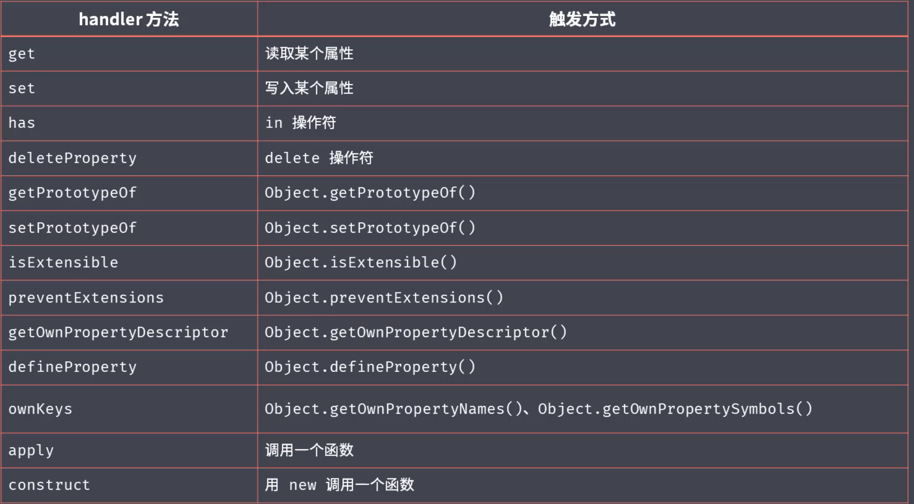
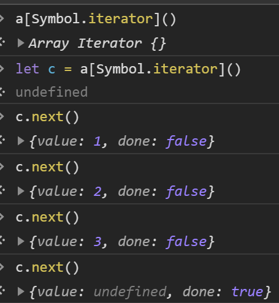
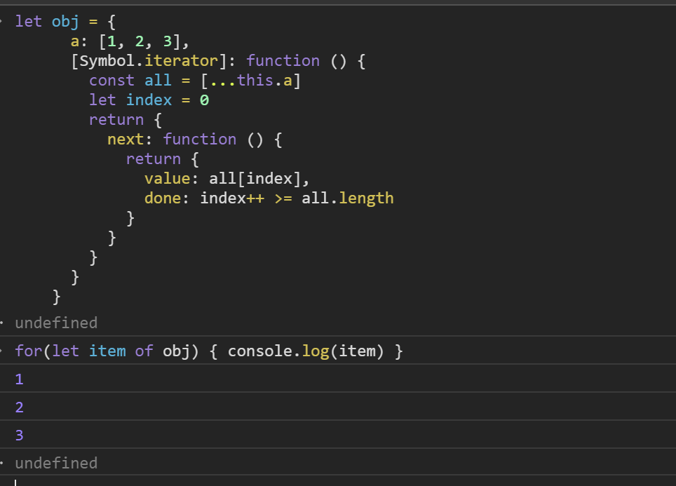
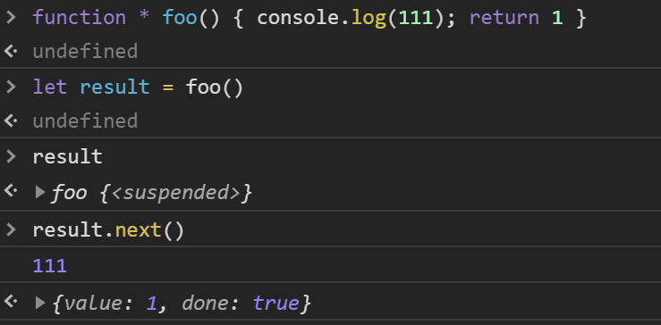
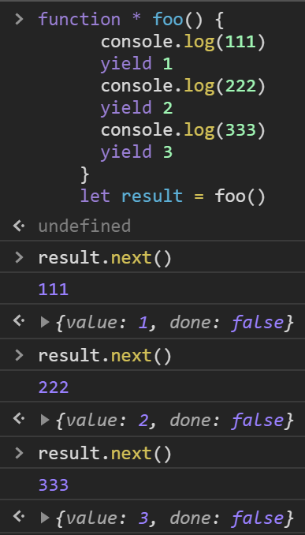

# &#x1F39F; Part-01 JavaScript 深度剖析

## &#x1F964; model-01 函数式编程与JS异步编程、手写Promise

### &#x1F47E; 函数式编程范式
  #### &#x1F4DA; 函数式编程 (Function Programming FP)

  - 面向对象编程的思维方式
    ```txt
      把现实世界中的事物抽象成程序世界中的类和对象，通过封装、继承、多态来演示事物事件的联系。
    ```
  - 函数式编程
    ```txt
      函数式编程就是用来描述数据(函数)之间的映射
    ```

  #### &#x1F4DA; 函数是一等公民 MDN(First-Class Function) 高阶函数(Higher-order Function)
    - 特点
      - 函数可以存储在变量中 （函数表达式）
        ```js
          // 把函数赋值给变量
          let fn = function() {
            console.log("Hello First-Class Function")
          }
        ```
        ```js
          const BlogCentent = {
            index (posts) { return View.index(posts) },
            show (posts) { return View.show(posts) },
            create (posts) { return View.create(posts) }
          }

          // 优化  函数在调用的时候直接传入参数
          const BlogCentent = {
            index: View.index,
            show: View.show,
            create: View.create
          }
        ```
      - 函数可以作为参数 传入 (Part-01/model-01/higher-order-function.js)
        ```js
          // forEach
          function forEach(arr, fn) {
            for (let i = 0; i < arr.length; i++) {
              fn(arr[i], i)
            }
          }

          // fliter
          function filter(arr, fn) {
            let result = []
            for (let i = 0; i < arr.length; i++) {
              if (fn(arr[i], i)) {
                result.push(arr[i])
              }
            }
            return result
          }
          // 总结 函数作为参数传入的好处
          //   1. 灵活 函数内部的执行条件/逻辑  是可以随着调用时改变的
        ```
      - 函数可以作为返回值
        ```js
          // 两种调用方式 
          function makeFn() {
            let result = 'Hello Higher Order Function'
            return function () {
              console.log(result)
            }
          }

          const fn = makeFn()
          fn()

          makeFn()()

          // 控制函数只能执行一次
          // once function 对传入函数只执行一次
          function once(fn) {
            let done = true
            return function (str) {
              if (done) {
                done = false
                fn.apply(this, arguments)
              }
            }
          }

          let conStr = once(function (str) {
            console.log(str)
          })

          conStr('已经执行')
          conStr('还可以再次执行吗')

          // 如上逻辑再加上定时器配合 可以作为一个防抖函数来执行
          // 上面的逻辑稍加改造成一个防抖函数
          function debounce(fn) {
            let result = true
            return function(str) {
              if (result) {
                result = false
                fn.apply(this, arguments)
                setTimeout(() => {
                  result = true
                }, 500);
              }
            }
          }
          let conStr = debounce(function (str) {
            console.log(str)
          })

          conStr('执行')
          conStr('执行')
          conStr('执行')
          conStr('执行')
          conStr('执行')
          setTimeout(() => {
            conStr('执行')
          }, 500);
        ```
    - 意义
      ```txt
        能让函数更灵活
        抽象可以帮助我们屏蔽细节， 只关注最后的结果
      ```

  #### &#x1F4DA; 闭包(Closure)
    - 定义 
      ```txt
      一个函数返回一个新的函数 并且返回的函数和当前词法作用域引用捆绑在一起形成闭包
      ```
    - 案例
      ```js
        // 利用闭包暂存次幂

        function makePower(power) {
          return function(number) {
            return Math.pow(number, power)
          }
        }

        const makePower2 = makePower(2)
        const makePower3 = makePower(3)

        console.log(makePower2(3))
      ```

  #### &#x1F4DA; 纯函数
    - 概念
      - 相同的输入永远会得到相同的输出，而且没有任何可观察的副作用
      ```
        类似数学中的函数(用来描述输入和输出的关系)
        函数式编程中函数中的变量是无状态的
        我们可以把结果交给另一个函数处理
      ```

  #### &#x1F4DA; [Lodash](https://www.lodashjs.com)
    - lodash是什么
      ```txt
        是一个一致性、模块化、高性能的 JavaScript 实用工具库。
        提供了各种Array Object等一些封装好的方法
      ```

  #### &#x1F4DA; 纯函数
    - 可缓存 
      ```txt
        因为纯函数相同的输入有相同的输出  所以可以把结果缓存下来 多次使用
      ```
      - lodash 的 memoize可以对纯函数实线缓存
      ```js
        const _ = require('lodash')

        function getArea(r) {
          console.log(r)
          return Math.PI * r * r
        }

        let getAreaWithMemory = _.memoize(getArea)
        console.log(getAreaWithMemory(4))
        console.log(getAreaWithMemory(4))
        console.log(getAreaWithMemory(4))
        console.log(getAreaWithMemory(5))
        console.log(getAreaWithMemory(5))
      ```
      - 自己实现一个memoize
        ```js
          function memoize(f) {
            let cache = {}
            return function() {
              let key = JSON.stringify(arguments)
              cache[key] = cache[key] || f.apply(f, arguments)
              return cache[key]
            }
          }

          let getAreaWithMemory = memoize(getArea)
          console.log(getAreaWithMemory(4))
          console.log(getAreaWithMemory(4))
          console.log(getAreaWithMemory(4))
          console.log(getAreaWithMemory(5))
          console.log(getAreaWithMemory(5))
        ```
    - 便于测试
      ```txt
      所有的纯函数在相同的输入会有相同的输出
      ```
    - 并行处理
      ```txt
        多线程操作全局变量时候，可能会造成共享变量被修改
        而纯函数不需要访问共享的内存数据，所以纯函数可以在并行环境下任意运行( webwork )
      ```
    - 副作用
      ```js
        // 不纯函数  因为函数输出的结果会和外部定义的mini变量有关系
        let mini = 18
        function checkAge(age) {
          return age > mini
        }

        // 纯函数(有硬编码 后续可以通过柯里化解决)
        function checkAge(age) {
          let mini = 18
          return age > mini
        }
      ```
      - 副作用来源
        ```txt
          配置文件...
        ```

  #### &#x1F4DA; 柯里化(Haskell Brooks Curry)
  - 定义
    ```txt
      当一个函数需要多个参数的时候， 我们可以调用一个函数只传入部分的参数(这部分参数以后永远不会变)，这个函数返回一个新的函数， 这个新的函数去接收剩余的参数， 并返回最终结果 
    ```
  - _.curry(func) lodash 中的函数通用柯里化方法
    - 功能
      ```txt
        创建一个函数，该函数接收一个或多个func的参数， 如果func所需要的参数都被传入， 则执行func返回结果。否则继续返回该函数并等待接收剩余参数
      ```
    - 参数
      ```txt
        需要柯里化的函数
      ```
    - 返回值
      ```txt
        柯里化后的函数
      ```
  - 总结
    - 柯里化可以让我们给一个函数传入较少的参数得到一个已经记住传入参数的新函数
    - 这是一种对函数参数的'缓存(闭包)'
    - 让函数更灵活， 粒度更小
    - 可以把多元函数(多个参数)转换为一元函数(一个参数)， 组合使用产生强大的功能


## &#x1F964; model-02 ES 新特性与 TypeScript、JS 性能优化

### &#x1F47E; ECMAScript 新特性
  #### &#x1F4DA; ECMAScript 概述
  ```txt
    只提供了基本的语法
    JavaScript实现了ECMAScript的标准, 在这个基础之上实现了一些扩展。

    浏览器环境 
    ECMAScript + BOM + DOM

    node 环境
    ECMAScript + fs + net + etc.
  ```

#### &#x1F4DA; ECMAScript2015   -> ES6
  1. 解决原有语法上的一些问题或者不足
  2. 对原有语法的增强
  3. 全新的对象、全新的方法、功能
  4. 全新的数据类型和数据结构
   
#### &#x1F4DA; let 关键字
  ```js
    // 1. 首先let 存在暂时性死区  也就是无法在定义之前获取
    console.log(i)
    let i = 0;

    // 2. 块级作用域 {}
    // 只在当前的花括号之内起作用
  ```

#### &#x1F4DA; const 关键字
  ```js
    // 只读  不能修改存储的内存的地址
    // 其他的和let相同
  ```

#### &#x1F4DA; 数组解构 根据下表提取
  ```js
    // 解构最后一个
    let arr = [1, 2, 3]
    cosnt [, , foo] = arr
    console.log(foo) // 3

    // 解构剩余
    const [foo, ...rest] = arr
    console.log(foo) // 1
    console.log(rest) // [2, 3]

    // 解构第一个
    let arr = [1, 2, 3]
    cosnt [foo] = arr
    console.log(foo) // 1

    // 解构不存在的 
    let arr = [1, 2, 3]
    cosnt [foo, bar, baz, more] = arr
    console.log(more) // undefined

    // 设置默认值  如果解构没有获取到值  则使用默认值
    let arr = [1, 2, 3]
    cosnt [foo, bar, baz, more = 'default'] = arr
    console.log(more) // default
  ```

#### &#x1F4DA; 对象解构  根据属性名提取
  ```js
    let obj = { name: 'zs', age: '12' }
    let { name } = obj
    console.log(name) // 'zs'

    //  重命名
    let { name: newName } = obj
  ```

#### &#x1F4DA; 模板字符串
  ```js
    let a = `hello world`

    // 1. 支持换行  多行
    // 2. 插值表达式
    // 3. 可以计算
    let name = 'ECMAScript'
    let b = `hello world${name}`
    console.log(b) // hello worldECMAScript

    let b = `hello world${1 + 2}`
    console.log(b) // hello world3
  ```

#### &#x1F4DA; 模板字符串 标签
  ```js
    //  myTagName是一个标签函数  就是一个普通函数
    let name = 'Tom' 
    let age = 12
    function myTagName(strings, name, age) {
      // strings是使用插值表达式分割的字符串数组 ['hello ', ', ', '']
      // name 是插值表达式传入的值
      // age同上
      console.log(strings, name, age)
      // 这个函数的返回值直接就是模板字符串的返回值
      // 如果返回123  则下面的result就是123
      // return 123

      // 所以我们可以在这里面处理模板字符串 
      // 比如可以在这里处理数字 将传入的数字在业务中是钱， 那么就可以在这里处理千分符  而且不会污染原来数字

      // 下面是正常返回
      return strings[0] + name + strings[1] + age + strings[2]
    }

    let result = myTagName`hello ${name}, ${age}`
    console.log(result)
  ```

#### &#x1F4DA; ES2015 字符串扩展方法 
  ```js
    // 判断字符串中是否存在指定的字符串
    // includes()
    let str = 'hello world'
    console.log(str.includes('o w')) // true

    // 下面两个方法  一个是判断字符串是否以指定字符开头  后面的是判断结尾的
    // startsWith()
    // endsWith()

    let str = 'hello world'
    console.log(str.startsWith('h')) // true
  ```

#### &#x1F4DA; ES2015 参数默认值
  ```js
    // 在定义函数时候， 指定形参的默认值， 当实参没有传入或者传入为undefined时， 此时使用默认值
    // 注意： 有默认值的形参一定要放到最后
    function foo(str, bar = 1) {
      console.log(bar)
    }
  ```

#### &#x1F4DA; ES2015 剩余参数
  ```js
    // 会接收当前函数传入的所有实参  并且存放在一数组当中 
    function foo(...arg) {
      console.log(bar) // [1, 2, 3]
    }
    foo(1, 2, 3)

    // 获取name除外的所有剩下的参数 只能使用一次
    function foo(name, ...arg) {
      console.log(name, arg) // Tom  [12, 170]
    }

    foo('Tom', 12, 170)
  ```

#### &#x1F4DA; ES2015 数组展开
  ```js
    let a = ['Tom', 12, 170]
    // 打印每一项
    function consoleLog(i) {
      console.log(i)
    }
    // 将数组展开然后将数组的每一项当做一个实参传入
    consoleLog(...a)
  ```

#### &#x1F4DA; ES2015 箭头函数
  ```js
    function inc(n) {
      console.log(n)
    }

    let inc = n => console.log(n)
  ```

#### &#x1F4DA; ES2015 箭头函数 this
  ```js
  // 箭头函数没有this的机制  箭头函数内部的this 取决于箭头函数定义的位置
    let person = {
      name: 'Tom',
      sayHi: () => console.log(this.name + 1),
      sayHis: function() {
        console.log(this.name)
      }
    }
    person.sayHi()
    person.sayHis()

    // 可以解决settimeout 这种全局调用的的回调中this指向的问题 
    person.saiHiAsync = function() {
      setTimeout(function() {
        console.log(this.name)
      })
    }

    person.saiHiAsyncs = function() {
      setTimeout(() => {
        console.log(this.name)
      })
    }
    person.saiHiAsync()
    // 因为箭头函数内部没有this  他的this取决于箭头函数定义的位置  当前箭头函数定义的位置的作用域内部this指向person
    person.saiHiAsyncs()
  ```

#### &#x1F4DA; ES2015 对象字面量增强
  ```js
    // 1. 当属性名和对应的值 的名字一样时, 对象定义属性名可以直接写
    // 2. 当属性名和要声明的方法名相同时, 同上
    // 3. 计算属性名: 声明对象的时候属性名采用动态的值去定义， 原本的js是不支持动态属性名的，只能在对象声明之后使用[] 去定义动态的属性名
    let name = 'zs'

    let people = {
      // name: name,
      name,
      age: 12,
      // getAge: function () {
      //   console.log(this.age)
      // },
      getAge() {
        console.log(this.age)
      },
      // 下面的做法是错误的随机属性名定义  之前如果想使用随机定义属性名需要在当前对象声明之后使用[]定义
      // Math.random(): '1'
      // 现在ES6 可以直接使用[]定义随机属性名
      [Math.random()]: '1',
      [1 + 1]: 2
    }
    people[Math.random()] = '1'
    console.log(people)
  ```

#### &#x1F4DA; ES2015 对象扩展方法
  - Object.assign
    ```js
      // 将指定对象合并到目标对象中 接受多个参数, 合并到第一个参数对象中 
      let source1 = {
        a: 1,
        b: 2
      }
      let source2 = {
        a: 11,
        c: 3,
        h: {
          a: 11
        }
      }
      let source3 = {
        b: 22,
        d: 4
      }
      let target = {
        a: 0,
        b: 0
      }

      let result = Object.assign(target, source1, source2, source3)
      console.log(result)
      // ！！！！！ 不支持深拷贝
    ```
  - Object.is
    ```js
      // 判断两个值是否相等
      // 和 === 区别  ===判断 +0 -0时 返回true     NaN === NaN 返回false 

      Object.is(+0, -0)
      Object.is(NaN, NaN)
    ```

#### &#x1F4DA; ES2015 Proxy
  ```js
    // proxy 监听对象  (代理)
    let person = {
      name: 'zs',
      age: 12
    }

    let result = new Proxy(person, {
      /**
        target: 当前监听的对象
        name: 要获取的属性名
      */
      get(target, name) {
        console.log(target, name)
        return name in target ? target[name] : undefined
      },
      /**
        target: 当前监听的对象
        key: 要设置的新属性名
        value: 要设置的属性值
      */
      set(target, key, value) {
        // 这里可以在添加值的时候 加入一些自己的逻辑  如果值不是指定类型的   可以使用throw new Error('抛出异常')抛出异常
        console.log(target, key, value)
        target[key] = value
      }
    })
    console.log(result.name)
  ```

#### &#x1F4DA; ES2015 Proxy对比defineProperty
  
  - defineProperty 不能监听到对象属性的删除 和 一些方法的调用
    ```js
      
      let person = {
        name: 'zs',
        age: 12
      }

      let result = new Proxy(person, {
        /**
          target: 当前监听的对象
          property: 要删除的属性名
        */
        deleteProperty(target, property) {
          console.log(target, property)
          delete target[property]
        }
      })

      delete result.name
      console.log(person)
    ```
  - 更好的支持数组对象的监视
    ```js
    let arr = []
    let result = new Proxy(arr, {
      set(target, key, value) {
        console.log(target, key, value)
        target[key] = value
        // 设置成功返回true
        return true
      }
    })
    // 类似push的方法都可以监听到
    result.push(1)
    console.log(arr)
    ```
  - 是以非侵入的方式监管了对象的读写
    ```js
      // 已经定义好的对象 我们不需要再添加额外的操作去监测
    ```
#### &#x1F4DA; ES2015 Reflect 静态类 提供了13个静态方法
  ```js
    // Reflect成员方法就是Proxy处理对象的默认实现
    // 提供了一套用于操作对象的API
    // 例如
    let obj = {
      name: 'zhh'
    }

    // 如果这里我们什么都不写  那内部默认执行的是什么呢  也就是这里的默认实现是通过Reflect实现的
    let result = new Proxy(obj, {})

    console.log('name' in obj)
    console.log(delete obj['name'])
    console.log(Object.keys(obj))

    console.log(Reflect.has(obj, 'name'))
    console.log(Reflect.deleteProperty(obj, 'name'))
    console.log(Reflect.ownKeys(obj))
  ```

#### &#x1F4DA; ES2015 Promise
  ```js
    // 更优的异步解决方案
    // 避免回调地狱
  ```

#### &#x1F4DA; ES2015 Class
  ```js
    function Person(name) {
      this.name = name
    }

    Person.prototype.say = function() {
      console.log(this.name)
    }
    
    let person = new Person('zs')

    class Person {
      constructor(name) {
        this.name = name
      }

      say() {
        console.log(this.name)
      }
    }

    let person = new Person('ls')
  ```

#### &#x1F4DA; ES2015 Class 实例方法  静态方法
  ```js
    // 实例方法需要这个类型构造的实例对象去调用
    // 静态方法直接通过类型本身调用

    // 专门添加静态方法的关键词 static 
    class Person {
      constructor(name) {
        this.name = name
      }

      say() {
        console.log(this.name)
      }

      static sayHi() {
        return new Person()
      }
    }
    // this不是指向实例对象的  而是指向当前类型
  ```

#### &#x1F4DA; ES2015 Class 继承extends
  ```js
    // 继承会继承父类所有的方法和属性  包括静态方法
    class Person {
      constructor(name) {
        this.name = name
      }

      say() {
        console.log(this.name)
      }

      static sayHi() {
        return new Person()
      }
    }

    class Student extends Person{
      constructor(name, age) {
        super(name)
        this.age = age
      }

      hello() {
        super.say()
        console.log(this.age)
      }
    }
  ```

#### &#x1F4DA; ES2015 Set
  ```js
    // Set 是一个集合 其内部不能存放重复的数据  重复添加会失效 
    // 介绍用法 
    let set = new Set()
    // 因为add方法返回当前set对象  所以可以链式调用
    set.add(1).add(2).add(3).add(2) // Set(3) { 1, 2, 3 }

    // 遍历
    set.forEach( i => console.log(i) )   // 这里也可以用for of去遍历哦

    // 获取长度
    set.size()

    // 判断是否存在某元素
    set.has(100)
    set.has(1)

    // 删除指定元素
    set.delete(2)

    // 清空set
    set.clear()

    // 主要作用是数组去重
    let arr = [1, 2, 3, 1, 2, 4]

    let result1 = Array.from(new Set(arr))
    let result2 = [...new Set(arr)]
    console.log(result1)
    console.log(result2)
  ```

#### &#x1F4DA; ES2015 Map 数据结构
  ```js
    // js对象 存储的key 不管是什么类型 最后都会转换为string类型 
    let obj = {}
    obj[1] = 1
    obj[true] = 2
    obj[{ a: 1 }] = 3
    console.log(obj)

    let m = new Map()

    const tom = { name: 'Tom' }

    m.set(tom, 100)

    console.log(m)

    console.log(m.get(tom))

    m.has()
    m.delete()
    m.clear()


    // 遍历
    m.forEach((value, key) => {
      console.log(value, key)
    })
  ```

#### &#x1F4DA; ES2015 Symbol
  ```js
    // 唯一性  只要调用就是全新的值

    // symbol 独一无二的值  是一种新的数据结构
    // 主要可以为对象添加独一无二的属性名
    let a = Symbol()
    let b = Symbol()
    // symbol 创建的值永远不可能相同
    // 这样就可以给对象创建唯一属性名的值了 也就是可以创建一些不想让外部修改的属性值了  私有成员
    // 这里我们使用计算属性名的方法创建
    const name = Symbol()
    let obj = {
      [name]: 1,
      getValue() {
        console.log(this[name])
      }
    }

    // 如果想让symbol相同可以使用symbol的for方法
    const s1 = Symbol.for('foo')
    const s2 = Symbol.for('foo')
    s1 === s1  // true

    // 因为传入的foo这个值都是会转换为字符串的  所以需要注意一切隐式类型转换

    // symbol有一些私有的属性   这些属性是为给symbol内部一些方法命名的
    console.log(Symbol.iterator)
    console.log(Symbol.hasInstance)

    // 而且可以修改toString的结果
    const obj = {
      [Symbol.toStringTag]: 'XObject' 
    }
    console.log(obj.toString())

    // 使用Symbol创建的属性名无法被for of 遍历到  使用Object.keys()也无法获取的

    // 但是可以使用Object.getOwnPropertySymbol(obj)获取
  ```

#### &#x1F4DA; ES2015 for of
  
  ```js
    // for 遍历数组
    // for in 遍历键值对
    
    // 上面都会存在一些局限性
    // for of 
    // 可以遍历数组 Set Map  在遍历Map的时候返回的是一个新的数组  可以使用结构再次获取
    let a = [1, 2, 3]
    for (let item of a) {
      console.log(item) // 1 2 3
    }

    // 但是for of 无法遍历基本的对象  提供了Iterable接口就是for of 的前提 可以理解为 for of 可以遍历实现了Iterable接口的数据结构
    // 可以被for of 实现遍历的数据结构  其原型对象上存在Symbol(Symbol.iterable)的一个方法 
    // 这个方法可以使用obj[Symbol.iterator]()获取  
    // 获取之后这个方法原型上有一个next()的方法 通过返回调用next 可以从第一项一直获取到最后一项
    // 也就是说next() 这个原型上的方法是相当于一个指针  (这里感觉就是链表)
  ```

#### &#x1F4DA; ES2015 迭代器
  
  ```js
    // 上面描述普通对象无法使用for of去遍历  是因为普通对象没有实现iterable方法(迭代器) 所以我们给定义普通对象自己实现一个迭代器方法
    let obj = {
      a: [1, 2, 3],
      [Symbol.iterator]: function () {
        const all = [...this.a]
        let index = 0
        return {
          next: function () {
            return {
              value: all[index],
              done: index++ >= all.length
            }
          }
        }
      }
    }
    // 这样我们就可以使用for of了 
  ```

#### &#x1F4DA; ES2015 迭代器模式
  ```txt
    迭代器模式我理解的是一种规范的实现，可以使用for of的数据类型 他是在语言层面的迭代器() 这种迭代器更像是一个链表
    而我们给普通对象实现的迭代器是为了获取对象指定内容的集合
  ```

#### &#x1F4DA; ES2015 生成器函数(Generator)
  - 
    ```js
      // 在复杂的异步代码 减少回调嵌套  提供更好的异步编程解决方案
      // 上图中的生成器函数可以看到我们调用foo函数  函数并没有按照预期的执行
      // 当我们看他的原型上可以看到他也实现了iterator
      // 他返回一个具有next方法的对象  可以通过next方法去执行函数
      function * foo() {
        console.log(123)
        return 111
      }

      let result = foo()
      result.next() // 他会先打印123  之后返回一个和iterator一样的迭代器返回结果 { value: 111, done: true }
    ```

  - 
    ```txt
      可以看到在调用函数的时候 函数并没有返回值  也就是说函数在没有调用next()方法之前不会执行的，当调用next()方法的时候 函数会执行到存在yield的地方  并将yield后面的值作为next()返回值返回 以此类推
    ```

  - 发号器
    ```js
      function * createIdMaker() {
        let id = 1
        while(true) {
          yield id++
        }
      }
    ```

  - 使用Generator 重写上面普通对象的iterator方法
    ```js
      let obj = {
      a: [1, 2, 3],
      [Symbol.iterator]: function () {
        const all = [...this.a]
        for(let item of all) {
          yield item
        }        
      }
    }
    ```

#### &#x1F4DA; ES2015 modules

#### &#x1F4DA; ES2016 概述
  ```js
    // 小版本 
    // 两个新增
      // 数组的includes
      // indexOf 查找数组中指定的值 返回索引 但是无法找到NaN的值
      // includes找到true  反之   但是可以拿到NaN

      // 幂运算
      Math.pow(2, 10) // 2的10次幂

      2 ** 10// 2的10次幂
  ```

#### &#x1F4DA; ES2017 概述 ECMAScript的第八个版本 2017-06发布
  - Object.values
    ```js
      let obj = {
        a: 1,
        b: 2
      }
      Object.values(obj) // [1, 2]
    ```

  - Object.entries
    ```js
      let obj = {
        a: 1,
        b: 2
      }
      Object.entries(obj) // [ ['a', 1], ['b', 2] ]
      // 所以这里就可以使用for of去遍历
      for (let [key, value] of Object.entries(obj)) {
        console.log(key, value)
      }

      // 这种二维数组的数据结构可以直接转换成Map对象的数据结构
      let result = new Map(Object.entries(obj)) // Map(2) {"a" => 1, "b" => 2}
    ```

  - Object.getOwnPropertyDescriptors
    ```js
      // 获取对象的完整描述信息
      // 一般对象定义的get set属性无法获取
      let obj = {
        firstName: 'zhao',
        lastName: 'hehe',
        get fullName() {
          return this.firstName + this.lastName
        }
      }
      // 配合ES5的get set使用
    ```
  
  - padStart padEnd
    ```js
      // 按照给定长度使用给定字符补充   可以实现对其的效果！！！
      a.padStart(16, '-') // "-----------12312"
      a.padEnd(16, '-')   // "12312-----------"
    ```

### &#x1F47E; TypeScript 语言

### &#x1F47E; JavaScript 性能优化
  #### &#x1F4DA; 强类型 弱类型 在语法层次的定义
    - 强类型
      ```js
        // 类型约束 
        // 没有类型隐式转换
        // 语言层面就提示错误的
      ```
    - 弱类型
      ```js
        // 没有类型约束  存在类型隐式转换
        // 编译阶段 通过逻辑反馈错误
      ```
  
  #### &#x1F4DA; 静态类型 动态类型
    - 静态类型
      ```js
        // 变量从声明之后类型就不能改变
        // 编译阶段会做类型检查
      ```
    - 动态类型
      ```js
        // 定义的变量可以任意改变类型   只是改变了存放的值
      ```

  #### &#x1F4DA; JavaScript 类型系统特征
    ```txt
      首先js是一门弱类型动态语言，这是由于当时js的需求只是一门脚本语言，而且当时的js代码也就几百行，如果加上类型系统，这样就会显的很多余，而且当时js是脚本语言，也就是说不存在编译阶段直接就运行。
    ```
  
  #### &#x1F4DA; JavaScript 弱类型问题
    ```js
      const obj = {}
      obj.name()
      // 首先obj本身不存在这个方法  此时调用会报错
      // 但是强类型语言会在语法层面上提示(编码阶段)

      function add(a, b) {
        return a + b
        add(100, '100')
      }
      // 弱类型语言存在隐式转换当没有注意的时候这种问题的触发几率很高

      obj[true] = 100
      // 我们定义的键是 true  而对象在定义这个属性的时候会将属性名转换为string 这样就无法获取
    ```

  #### &#x1F4DA; JavaScript 强类型优势
    - 错误能更早的发现

    - 智能  准确

    - 重构
    
    - 减少参数类型的判断

