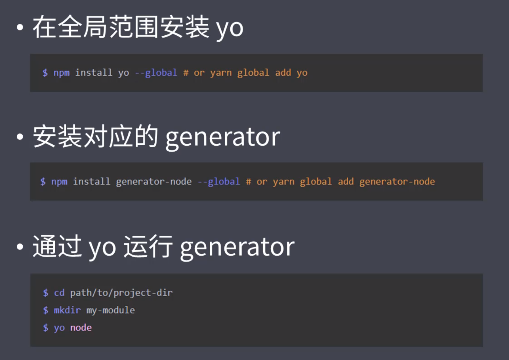
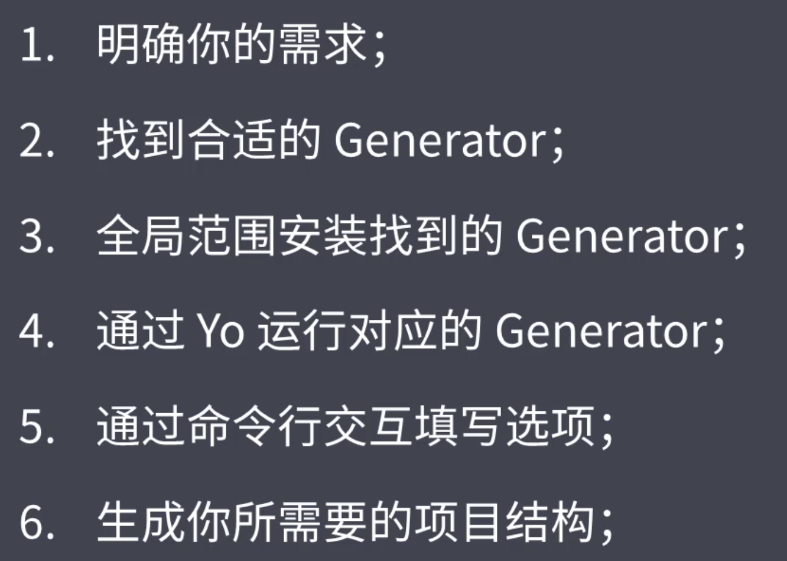

## &#x1F964; model-01 开发脚手架及封装自动化构建工作流

### &#x1F47E; 工程化概述
#### &#x1F4DA; 工程化的定义和主要解决的问题
  - 传统语言或者语法的弊端
  - 无法使用模块化/组件化
  - 重复的机械工作
  - 代码风格统一 质量保证
  - 依赖后端服务接口支持
  - 整体依赖后端项目

#### &#x1F4DA; 一个项目过程中工程化的表现
  - 一切以提高效率、降低成本、质量保证为目的的手段都属于[工程化]
  - 创建项目
    ```txt
      创建项目结构 
      创建特定类型文件
    ```
  - 编码
    ```txt
      格式化代码
      校验代码风格
      编译/构建/打包
    ```
  - 预览/调试
    ```txt
      webServe/Mock/Live Reloading/HMR/Source Map
    ```
  - 提交
    ```txt
      git Hooks
      Lint-staged
      持续集成
    ```
  - 部署
    ```txt
      CI/CD
      自动发布
    ```

#### &#x1F4DA; 自动化 !== 工具
  - 自动化不是工具 可以说是一些工具的集合
  - 一些成熟的工程化集成
    - create-react-app
    - vue-cli
    - angular-cli
    - gatsby-cli


### &#x1F47E; 脚手架工具
#### &#x1F4DA; 脚手架工具概要
  - 本质作用
    - 创建项目基础结构提供项目规范和约定
  - 相同的部分
    - 组织结构
    - 开发范式
    - 模块依赖
    - 工具配置
    - 基础代码
  - 内容概要
    - 脚手架
    - 常用的脚手架工具
    - 通用脚手架工具剖析
    - 发开一款脚手脚

#### &#x1F4DA; 常用的脚手架工具
  - 创建项目 通用性项目脚手架 Yeoman
  - 开发过程 创建一些特定类型文件 Plop

#### &#x1F4DA; Yeoman
  ```txt
    通过不同Generator搭建不同的脚手架
    但是在一些场景下 人们觉得不够专注
  ```

#### &#x1F4DA; Yeoman使用
  
  ```txt
    npm install yo -g
    yo 要搭配Generator去使用
    不同的Generator能生成不同的项目  所以不同的项目得安装不同的Generator
  ```

#### &#x1F4DA; Yeoman使用 Sub Generator
  
  ```txt
    yo node:cli
    有时候我们不需要创建完整的项目结构 只需要创建一部分
    那这时候可以使用yeoman提供的SubGenerator

    之后将这条命令设置成全局的 
    npm link
    之后全局my-model --help  就可以看到我们自己安装的cli工具命令了
  ```

#### &#x1F4DA; Yeoman使用 自定义Generator
  - 创建一个空文件夹
  - 初始化npm  npm init -y
  - 安装一个Generator的基类 npm install yeoman-generator 这里面提供了一些基类函数 让我们创建的时候更加便捷
  - 安装之后打开这个目录 创建一个文件目录 generators/app/index.js
  ```txt
    场景: 市面上的脚手架基本都是基于框架来制定的， 而我们可能实际开发使用的每次都需要配置一些第三方插件  这就让我们需要更多的时间去处理

    自定义Generator可以让我们生成项目的一部分目录结构
  ```

#### &#x1F4DA; Yeoman使用 自定义Generator 根据模板创建文件
  - app下面创建templates模板文件 
  - 先写好模板的内容
  - 然后确定模板路径  this.templatePath('foo.txt')  会自动去templates下面去找
  - 确定输出路径  还是使用 this.destinationPath('fooCopy.txt')
  - 之后灌入
  - 具体看generator-sample/generator/app/index.js
  
#### &#x1F4DA; Yeoman使用 自定义Generator 接收用户传入的数据
  
### &#x1F47E; 自动化构建