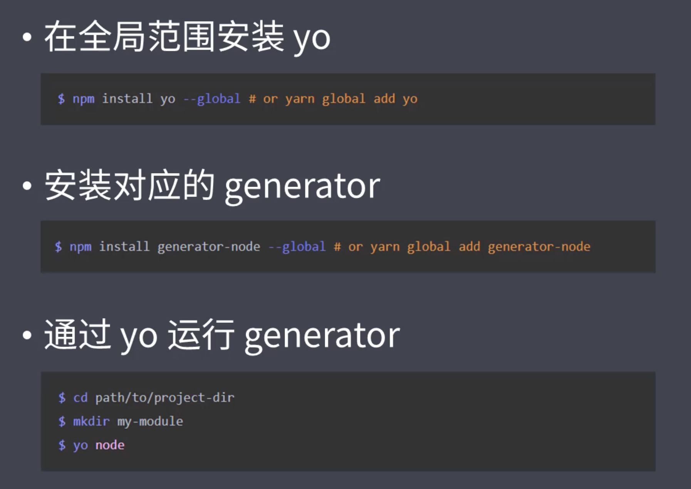
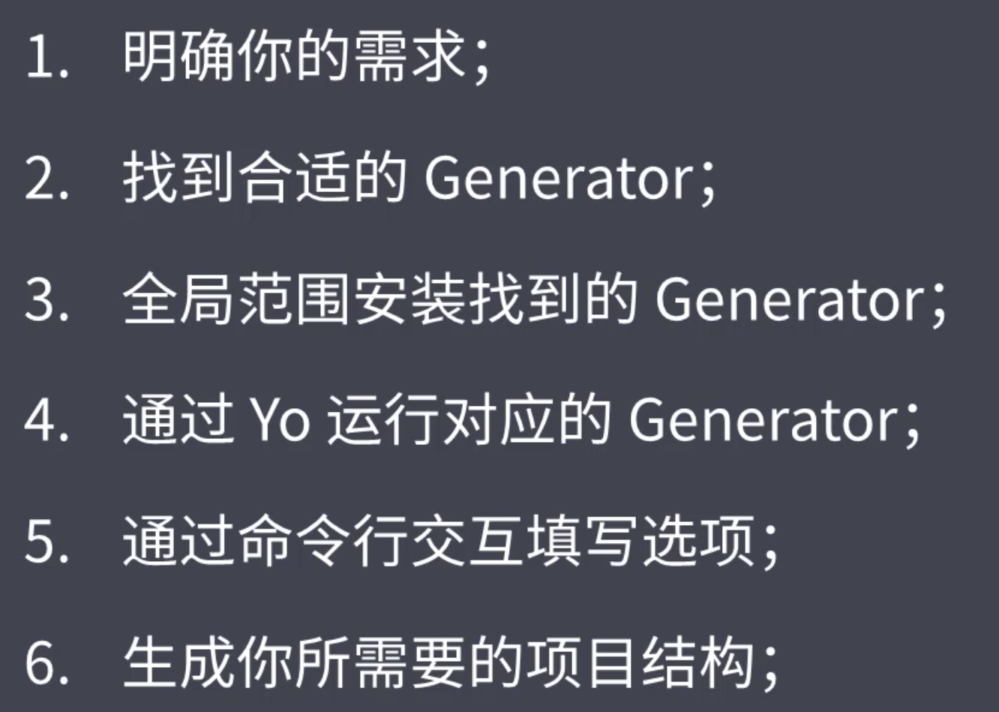

## &#x1F964; model-01 开发脚手架及封装自动化构建工作流

### &#x1F47E; 工程化概述
#### &#x1F4DA; 工程化的定义和主要解决的问题
  - 传统语言或者语法的弊端
  - 无法使用模块化/组件化
  - 重复的机械工作
  - 代码风格统一 质量保证
  - 依赖后端服务接口支持
  - 整体依赖后端项目

#### &#x1F4DA; 一个项目过程中工程化的表现
  - 一切以提高效率、降低成本、质量保证为目的的手段都属于[工程化]
  - 创建项目
    ```txt
      创建项目结构 
      创建特定类型文件
    ```
  - 编码
    ```txt
      格式化代码
      校验代码风格
      编译/构建/打包
    ```
  - 预览/调试
    ```txt
      webServe/Mock/Live Reloading/HMR/Source Map
    ```
  - 提交
    ```txt
      git Hooks
      Lint-staged
      持续集成
    ```
  - 部署
    ```txt
      CI/CD
      自动发布
    ```

#### &#x1F4DA; 自动化 !== 工具
  - 自动化不是工具 可以说是一些工具的集合
  - 一些成熟的工程化集成
    - create-react-app
    - vue-cli
    - angular-cli
    - gatsby-cli


### &#x1F47E; 脚手架工具
#### &#x1F4DA; 脚手架工具概要
  - 本质作用
    - 创建项目基础结构提供项目规范和约定
  - 相同的部分
    - 组织结构
    - 开发范式
    - 模块依赖
    - 工具配置
    - 基础代码
  - 内容概要
    - 脚手架
    - 常用的脚手架工具
    - 通用脚手架工具剖析
    - 发开一款脚手脚

#### &#x1F4DA; 常用的脚手架工具
  - 创建项目 通用性项目脚手架 Yeoman
  - 开发过程 创建一些特定类型文件 Plop

#### &#x1F4DA; Yeoman
  ```txt
    通过不同Generator搭建不同的脚手架
    但是在一些场景下 人们觉得不够专注
  ```

#### &#x1F4DA; Yeoman使用
  
  ```txt
    npm install yo -g
    yo 要搭配Generator去使用
    不同的Generator能生成不同的项目  所以不同的项目得安装不同的Generator
  ```

#### &#x1F4DA; Yeoman使用 Sub Generator   ---./generator-sanple
  
  ```txt
    yo node:cli
    有时候我们不需要创建完整的项目结构 只需要创建一部分
    那这时候可以使用yeoman提供的SubGenerator

    之后将这条命令设置成全局的 
    npm link
    之后全局my-model --help  就可以看到我们自己安装的cli工具命令了
  ```

#### &#x1F4DA; Yeoman使用 自定义Generator   ---./generator-vueDemo
  - 创建一个空文件夹
  - 初始化npm  npm init -y
  - 安装一个Generator的基类 npm install yeoman-generator 这里面提供了一些基类函数 让我们创建的时候更加便捷
  - 安装之后打开这个目录 创建一个文件目录 generators/app/index.js
  ```txt
    场景: 市面上的脚手架基本都是基于框架来制定的， 而我们可能实际开发使用的每次都需要配置一些第三方插件  这就让我们需要更多的时间去处理

    自定义Generator可以让我们生成项目的一部分目录结构
  ```

#### &#x1F4DA; Yeoman使用 自定义Generator 根据模板创建文件
  - app下面创建templates模板文件 
  - 先写好模板的内容
  - 然后确定模板路径  this.templatePath('foo.txt')  会自动去templates下面去找
  - 确定输出路径  还是使用 this.destinationPath('fooCopy.txt')
  - 之后灌入
  - 具体看generator-sample/generator/app/index.js
  
#### &#x1F4DA; Yeoman使用 自定义Generator 接收用户传入的数据
  - 模板语法 <%= keyName %>
  - 当我们就是想打印出<%= xxx %> 的时候 使用转义 <%%= keyName %>

#### &#x1F4DA; Yeoman使用 自定义Generator 发布到NPM
  - npm publish
  - 这里上传到npm的时候可能会提示一个错误  因为国内镜像是只读的问题
  - 解决方案
    - 更改本地镜像
    - 使用 npm publish  --registry=https://  更改为官方镜像
    
#### &#x1F4DA; Plop 一个小而美的脚手架工具 ---./Plop
  - 可以在项目中创建重复的同类型文件
      
#### &#x1F4DA; Plop 基本使用
  - npm init
  - npm install plop
  - 根目录创建plop-templates模板文件 
  - 模板文件后缀 .hbs 文件编辑使用 {{  }} 模板语法
  - 根目录创建plopfile.js  入口文件
    ```js
      // plop 入口文件 需要导出一个函数
      // 次函数接收一个plop对象  用于创建生成器任务

      module.exports = plop => {
        plop.setGenerator('component', {
          // 描述
          description: 'creaste vue components',
          prompts: [
            {
              type: 'input',
              name: 'name',
              message: 'component name',
              default: 'MyComponents'
            }
          ],
          // 动作对象
          actioncs: [
            {
              type: 'add',
              // 目标文件路径
              path: 'components/{{name}}/{{name}}.vue',
              // 模板路径
              templateFile: 'plop-templates/components.hbs'
            }
          ]
        })
      }
    ```
  - 需要全局安装plop  npm install plop -g
  - 之后在命令行启用命令 npm plop component   component是定义的生成器名字
      
#### &#x1F4DA; 脚手架工作原理   ---./cliDemo
  - 结合用户输入 生成一些固定的文件
  - npm init
  - 在package.json 创建一个字段 bin 内容为cli入口文件 
    ```json
      "bin": "cli.js"
    ```
  - 想要和用户交互 需要安装inquirer这样的模块  npm install inquirer
    ```js
      inquirer.prompt([
        {
          type: 'input',
          name: 'name',
          message: 'You Project name?'
        }
      ])
    ```
  - 接收用户的输入
    ```js
      inquirer.prompt([
        {
          type: 'input',
          name: 'name',
          message: 'You Project name?'
        }
      ]).then(anwsers => {
        console.log(anwsers)
      })
    ```
  - 获取目标目录和模板目录  之后遍历模板文件写入路标目录
    ```js
      inquirer.prompt([
        {
          type: 'input',
          name: 'name',
          message: 'You Project name?'
        }
      ]).then(anwsers => {
        // 根据用户回答生成文件
        const temPath = path.join(__dirname, 'templates')
        // 目标目录  获取当前命令行路径
        const dirPath = process.cwd()
        // 将模板目录输出到目标目录
        fs.readdir(temPath, (err, files) => {
          if (err) throw err
          files.forEach(file => {
            // 通过模板渲染文件 这里使用模板引擎 ejs  第一个参数模板绝对路径  第二个当前数据上下文  第三个回调函数
            ejs.renderFile(path.join(temPath, file), anwsers, (err, result) => {
              if (err) throw err
              // 写入目标目录
              fs.writeFileSync(path.join(dirPath, file), result)
            })
          })
        })
      })
    ```

### &#x1F47E; 自动化构建
        
#### &#x1F4DA; 自动化构建简介
  - 机器代替手动完成工作
  - 构建就是从一个东西转换为另一个东西
  - 源代码 -> 生产环境代码 (提高开发效率)

#### &#x1F4DA; 常用的自动化构建工具
  - Grunt
    ```txt
      构建过程基于临时文件实现，构建速度比较慢 每一步都会有磁盘读写操作
    ```
  - Gulp
    ```txt
      基于内存实现 相对于磁盘读写效率就高很多  支持同时支持多个任务
    ```
  - FIS
    ```txt
      百度开发
      大而全
    ```

#### &#x1F4DA; Grunt使用
  - 定义任务
    ```js
      module.exports = grunt => {
        // 定义任务foo
        grunt.registerTask('foo', 'is foo', () => {
          console.log('foo')
        })
        
        // 定义任务bar
        grunt.registerTask('bar', 'is bar', () => {
          console.log('bar')
        })
        
        // 定义任务other 并且在任务内部使用任务foo  bar
        grunt.registerTask('other', () => {
          console.log(123)
          grunt.task.run('foo', 'bar')
        })
      }
    ```
    ```txt
      使用npm window 需要全局安装grunt-cli
      grunt foo
      grunt bar
      grunt other
    ```

  - 默认执行任务
    ```js
      module.exports = grunt => {
        // 定义任务foo
        grunt.registerTask('foo', 'is foo', () => {
          console.log('foo')
        })
        
        // 定义任务bar
        grunt.registerTask('bar', 'is bar', () => {
          console.log('bar')
        })
        
        // 定义任务other 并且在任务内部使用任务foo  bar
        grunt.registerTask('other', () => {
          console.log(123)
          grunt.task.run('foo', 'bar')
        })
        
        // 默认任务执行  foo bar   
        // grunt
        grunt.registerTask('default', 'is default', ['foo', 'bar'])
      }
    ```

  - 异步任务
    ```js
      // 异步任务
      // 由于函数体中需要使用 this，所以这里不能使用箭头函数
      // 如果需要异步可以使用 this.async() 方法创建回调函数
      // 默认 grunt 采用同步模式编码
      grunt.registerTask('async-task', function() {
        const done = this.async()
        setTimeout(() => {
          grunt.task.run('foo')
          // 异步结束之后调用done
          done()
        }, 1000);
      })
    ```

  - 任务执行失败
    ```js
      // 怎么让任务执行失败  registerTask的回调函数返回false
      grunt.registerTask('err-task', () => {
        console.log('err-task-message')
        return false
      })
    ```
#### &#x1F4DA; Gulp使用
  - 定义任务
    ```js
      exports.foo = done => {
        console.log(123)
        done()
      }
    ```
    ```txt
      npm install gulp-cli -g
      gulp foo
    ```

  - 可以返回Promise来判断任务执行是否成功
    ```js
      // promise的状态也可以作为返回值返回 去作为任务的返回对象
      exports.promise = () => {
        console.log('promise task')
        return Promise.resolve()
      }
    ```

  - 异步任务
    ```js
      const timeout = time => {
        return new Promise(resolve => {
          setTimeout(resolve, time)
        })
      }

      exports.async = async () => {
        await timeout(1000)
        console.log('async task')
      }
    ```
  
  - process
    ```js
      const fs = require('fs')
      const { Transform } = require('stream')

      exports.default = () => {
        // 文件读取流
        const readStream = fs.createReadStream('normalize.css')

        // 文件写入流
        const writeStream = fs.createWriteStream('normalize.min.css')

        //  转换流
        const transformStream = new Transform({
          // 核心转换过程
          transform: (chunk, encoding, callback) => {
            // 当前文件流转换为string
            const input = chunk.toString()
            const output = input.replace(/\s+/g, '').replace(/\/\*.+?\*\//g, '')
            // 错误优先的回调函数
            callback(null, output)
          }
        })
        return readStream
          .pipe(transformStream) // 转换
          .pipe(writeStream) // 写入
      }
    ```

  - 文件流操作
    ```js
      const { src, dest }  = require('gulp')
      const style = () => {
        // 读取流
        return src('src/assets/styles/*.scss', { base: 'src' })
          // 将未换行的括号换行 用对应的插件处理流
          .pipe(plugins.sass({ outputStyle: 'expanded' }))
          // 流处理操作的结果文件
          .pipe(dest('temp'))
      }
      module.exports = {
        style
      }
    ```
    ```
    ```

  - 串行任务/并行任务
    - series 串行
      ```js
        const { src, dest, series }  = require('gulp')
        const style = () => {
          // 读取流
          return src('src/assets/styles/*.scss', { base: 'src' })
            // 将未换行的括号换行 用对应的插件处理流
            .pipe(plugins.sass({ outputStyle: 'expanded' }))
            // 流处理操作的结果文件
            .pipe(dest('temp'))
        }

        const script = () => {
          return src('src/assets/scripts/*.js', { base: 'src' })
            // 你得告诉他用什么去处理
            .pipe(plugins.babel({ presets: ['@babel/preset-env'] }))
            .pipe(dest('temp'))
            // 这里可以在下面直接bs配置中使用files直接监视文件改变  但是这里为了减少开销 在这里使用流的方式给浏览器
            .pipe(bs.reload({ stream: true }))
        }
        // 串行 先执行style 再执行script
        const foo = series(style, script)

        module.exports = {
          foo
        }
      ```
    - parallel 并行
      ```js
        const { src, dest, parallel }  = require('gulp')
        const style = () => {
          // 读取流
          return src('src/assets/styles/*.scss', { base: 'src' })
            // 将未换行的括号换行 用对应的插件处理流
            .pipe(plugins.sass({ outputStyle: 'expanded' }))
            // 流处理操作的结果文件
            .pipe(dest('temp'))
        }

        const script = () => {
          return src('src/assets/scripts/*.js', { base: 'src' })
            // 你得告诉他用什么去处理
            .pipe(plugins.babel({ presets: ['@babel/preset-env'] }))
            .pipe(dest('temp'))
            // 这里可以在下面直接bs配置中使用files直接监视文件改变  但是这里为了减少开销 在这里使用流的方式给浏览器
            .pipe(bs.reload({ stream: true }))
        }
        // 并行执行
        const foo = parallel(style, script)

        module.exports = {
          foo
        }
      ```