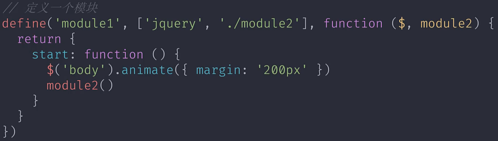
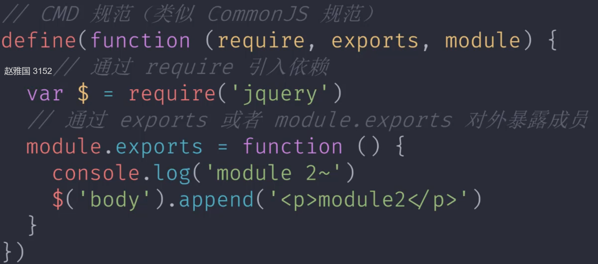
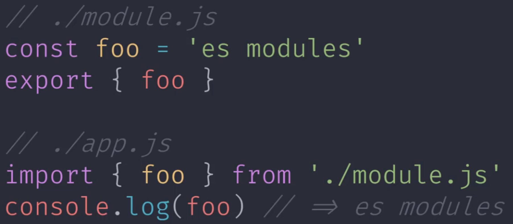
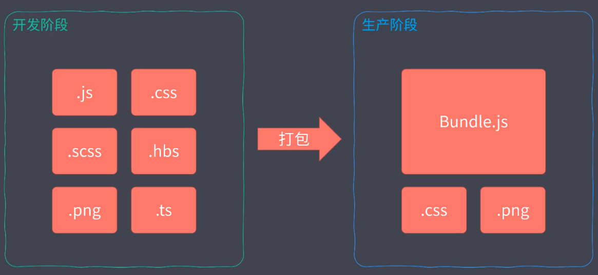
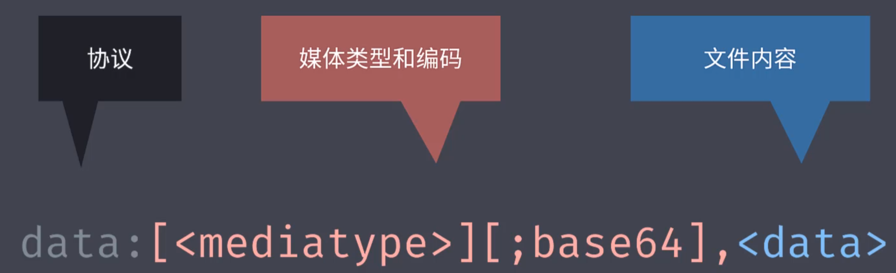
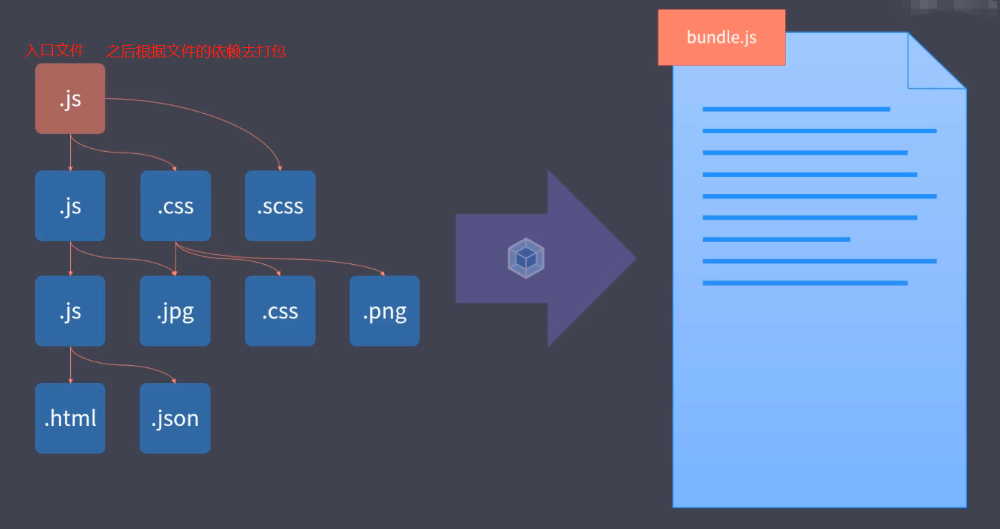
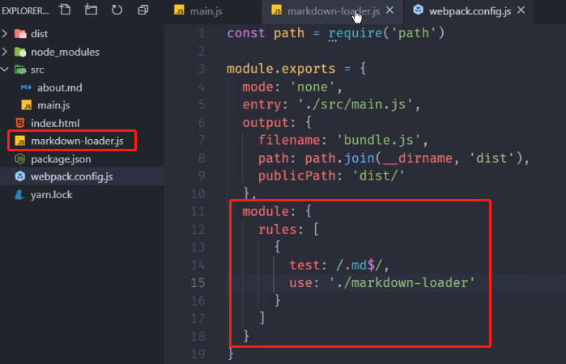
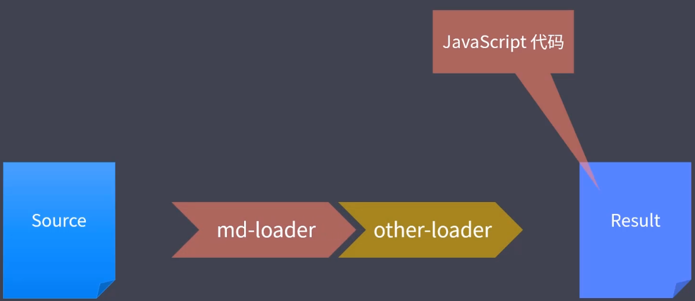

## &#x1F964; model-02 模块化开发与规范化标准> ES Modules 特性

### &#x1F47E; 模块化开发
#### &#x1F4DA; 模块化开发
  - 按照功能的不同区划分不同的代码

#### &#x1F4DA; 模块化演变过程
  - 每一个单独的文件就是一个模块
  - 命名空间的方式
  - 自调用函数

#### &#x1F4DA; 模块化规范的出现
  - commonJS 规范  同步模式加载 (node)
    - 一个文件就是一个模块
    - 每个模块都有单独的作用域
    - 通过module.exports导出成员
    - 通过require函数载入模块
  - AMD(Asynchronous Module Defintion)(异步的模块规范)
    - require.js
    - AMD使用起来相对复杂
    - 模块js文件请求频繁
    - 
  - sea.js + CMD
    - 

#### &#x1F4DA; 模块化标准规范
  - node环境   -> commonJS 规范
  - 浏览器环境 -> ES Modules

#### &#x1F4DA; ES Modules 基本特性
  - 默认采用严格模式执行  忽略 'use strict'的声明
  - 每个ES Module 都是单独的私有作用域
  - ESM 通过CORS请求外部JS模块 请求地址必须支持CORS
  - ESM 的 script 标签会延迟执行  等待当前浏览器DOM渲染之后执行 类似 defer

#### &#x1F4DA; ES Modules 导出
  - 

#### &#x1F4DA; ES Modules 导入导出注意事项
  - export { foo, add }  
    ```txt
      这种语法的导出看似是一个字面量对象 实则不是 这只是export的写法  这不是一个对象
      export default { foo, add } 这样才是导出一个对象
    ```
  - export 导出的是变量的引用 即使是简单数据类型也是引用
  - export 导出的是只读的 并不能在导出的文件中更改
  - import { foo, add } from './app.js'
    ```txt
      import 并不是一个解构
      如果我们导出 export default { foo, add }
      这样导入是报错的 import { foo, add } from './app.js'
      所以这里的import不是解构  就像export导出一样 就就是一种固定的语法
    ```
  - import 导入的路径问题
    - 相对路径必须写完整 在ESmodule当中
    - 文件后缀必须写完整
    - 可以直接导入CDN的文件
    - 可以使用绝对路径
    - 如果只想要执行导入的模块直接引入就ok了 
      ```js
        import {} from './app.js'
        // 简写 直接加载这个模块 并不需要提取模块的变量
        import './app.js'
      ```
    - 如果一个模块导出的成员很对  那么在导入的时候可以使用* 的方式重命名获取
      ```js
        // 导入的成员会以对象的方式存在于echarts
        import * as echarts from 'echarts'
        console.log(echarts)
      ```
    - 动态导入
      ```js
        // 提供了一个全局import函数 该函数返回一个Promise实例 所以可以在回调用获取导入的数据
        import('./app.js').then(data => {
          console.log(data)
        })
      ```
    - 导入具名成员和默认成员
      ```js
        // 导出
        export { foo, add }
        export default name
      ```
      ```js
        // 导入
        // 1. 默认导出的可以直接再导入中写 
        import name, { foo, add } from './app.js' 
        // 2. 也可以重命名写
        import { foo, add, default as names } from './app.js' 
      ```

#### &#x1F4DA; ES Modules 导出导入的模块
  - 运用场景
    ```txt
      写了很多子组件  
      需要在根组件中导入引用 
      但是我不想在根组件导入那么一堆
    ```
    ```js
      // 三个组件
      // button
      // header
      // footer
      // index是我的根组件
      // 我可以用一个中间的文件将这几个组件集中导入 然后集中导出
      // middle.js 
      // 这样的写法可以直接将导入的内容直接导出
      export { header } from './header.js'
      export { footer } from './footer.js'
      export { button } from './button.js'

      // index
      import { header, footer, button } from './middle.js'

      // 如果别的模块是默认导出
      // 那么在导入导出的时候需要重命名
      export { default as header} from './footer.js'
      // 或许可以这样
      export header from './footer.js'
    ```

#### &#x1F4DA; ES Modules 浏览器环境 Polyfill
  - 可以使用第三方库引入处理
  - 比如我们一个很普通的HTML文件代码用了导入导出 这时候在IE等一些浏览器无法执行
  - 此时我们引用 browser-es-module-loader
  - browser-es-module-loader会帮我们把代码执行
  - 但是会存在一个问题  在IE我们的代码是正常运行了  但是在Chrome代码会被执行两次 原因就是Chrome本身就支持模块的导入导出  浏览器本身会执行代码 但是引入的那个包也会帮你执行一次 这样就会执行两次
  - 解决方法
    ```html
      <!-- 这段代码会在当前浏览器不支持 module的情况下执行其中的代码  这样我们就可以在包导入的那个script加上这个关键词 -->
      <script nomodule>
        alert(123)
      </script>
    ```

#### &#x1F4DA; ES Modules in Node.js - 支持情况
  - 在node(8.5) 之后可以使用
  - 需要把文件后缀改为xxx.mjs
  - 执行 node --experimental-modules index.mjs  这个参数代表启用ESModule这个实验特性
  - 以上操作就是想要在node中使用 ESModule必须做的事情
  - 导入一些原生的模块 也可以直接导入第三方模块
    ```js
      import fs from 'fs'
    ```
    
#### &#x1F4DA; ES Modules in Node.js - 与 CommonJS 交互
  - ES Module 中可以导入 CommonJS 模块
  - CommonJS 中不能导入 ES Module 模块
  - CommonJS 始终都会导出一个默认成员
  - import 不是解构！！！！！！！！！！！！！！！！！！！！！！
  ```js
    // common.js
    // 1. common 导出
    const foo = 'zs'
    module.exports = foo

    // 2. import 不是解构
    module.exports = {
      name: 'zsd',
      age: 12
    }
  ```
  ```js
    // ES Module 
    // 1. 导入 common导出的内容
    import foo from './common.js'

    // 2. import 导入但是不能解构！！！
    √ import obj from './common.js'
    × import { name, age } from './common.js'
  ```

#### &#x1F4DA; ES Modules in Node.js - 与 CommonJS 的差异
  ```js
    // common中内置的一些全局变量 在ES Modules中怎么使用
    // 因为下面的变量是 Common 单独提供的
    // require
    // module
    // exports
    // __filename
    // __dirname
  ```
  ```js
    // ES Module
    // require
    // module
    // exports
    // 可以使用 ES Module 的 import 和 export代替

    // __filename
    // __dirname
    // 可以看下面怎么实现
    // ES Module 提供了 import.meta.url
    import { fileURLToPath } from 'url'
    import { dirname } from 'path'
    const __filename = fileURLToPath(import.meta.url)
    
    const __dirname = dirname(__filename)
  ```

#### &#x1F4DA; ES Modules in Node.js - 新版本进一步支持
  ```js
    如果想在node环境中直接使用ES Module  那么就在
    package.json中定义一个字段
    {
      "type": "module"
    }
    这样整个环境就是按照ES Modules 的规范来了
    但是这样commonJS 规范就不能使用了  
    想要使用的话就需要将common.js  改为 common.cjs去执行
  ```

### &#x1F47E; Webpack 打包
#### &#x1F4DA; 模块打包工具的由来
  - ES Module存在环境问题
  - 模块化文件过多 网络请求频繁
  - 不仅仅js需要模块
    ```txt
      所以就有了这样的想法 
      能使用模块化开发 并且能兼容各种环境运行
    ```
  - 


#### &#x1F4DA; 模块打包工具概要
  - webpack
    - 模块打包器 使用loader去处理代码兼容问题
    - 模块拆分(Code Splitting) 解决文件大的问题 实现增量加载(动态加载)
    - 资源模块(Asset Module) 其他类型的文件
    - 整个对前端项目的模块化 并不用担心环境的因素
    
#### &#x1F4DA; Webpack 快速上手
  - npm install webpack webpack-cli -g
  - webpack
  - 会默认找到index.js 打包
  - 之后可以将执行命令添加到package的script当中

#### &#x1F4DA; Webpack 快速上配置文件
  ```js
    // webpack.config.js   node 环境
    const path = require('path')
    module.exports = {
      // 入口
      entry: './src/main.js',
      // 出口
      output: {
        // 打包之后文件名
        filename: 'bundle.js',
        // 打包之后路径  就会在当前目录output下面打包
        path: path.join(__dirname, 'output')
      }
    }
  ```

#### &#x1F4DA; Webpack 工作模式
  ```js
    // webpack.config.js   node 环境
    const path = require('path')
    module.exports = {
      // 工作模式
      // 1. production 代码压缩 优化打包结果
      // 2. developme 优化打包速度 添加一些调试的辅助代码
      // 3. none 最原始状态的打包  不做任何处理
      // 具体差异可以在官网找到
      // 然后可以通过执行命令的时候动态传入
      // webpack --mode development
      mode: 'development',
      // 入口
      entry: './src/main.js',
      // 出口
      output: {
        // 打包之后文件名
        filename: 'bundle.js',
        // 打包之后路径  就会在当前目录output下面打包
        path: path.join(__dirname, 'output')
      }
    }
  ```

#### &#x1F4DA; Webpack 资源模块加载
  - webpack是整个前端的打包工具，可以打包任意类型的文件
  - 通过各种loader实现
    ```js
      // webpack.config.js   node 环境
    const path = require('path')

    module.exports = {
      mode: 'none',
      entry: './src/main.js',
      output: {
        filename: 'bundle.js',
        path: path.join(__dirname, 'output')
      },
      module: {
        rules: [
          {
            // 匹配类型文件
            test: /.css$/,
            // css-loader 的作用是处理css文件 将css代码打包让js处理 但是单独的css-loader只是打包处理 并没有引入
            // 所以又需要一个loader style-loader 
            // style-loader 通过style标签将css挂载到HTML中
            // 多个loader执行的时候从后往前执行 css-loader  ->  style-loader
            use: [
              'style-loader',
              'css-loader'
            ] 
          }
        ]
      }
    }
    ```
#### &#x1F4DA; Webpack 导入资源模块
  - 通过源码可以看到css也是通过js导入到项目的
  - 根据代码的需要动态的导入资源
  - 用js去驱动整个前端的业务功能
#### &#x1F4DA; Webpack 文件资源加载器
  - 加载一些image font 等 需要文件资源加载器
  - file-loader
    ```js
      const path = require('path')
      module.exports = {
        mode: 'none',
        entry: './scr/main.js',
        output: {
          filename: 'bundle.js',
          path: path.join(__dirname, 'output'),
          publicPath: 'dist/' // 绝对路径  后面要加 / !!!!!!!!!!!
        },
        // 正常这样处理之后 文件中加载图片是去网站根目录去找图片的 正确地址在dist文件下 
        // 所以需要在output中设置告诉webpack打包之后的文件存放在哪
        module: {
          rules: [
            {
              test: /.png$/',
              use: 'file-loader'
            }
          ]
        }
      }
    ```

#### &#x1F4DA; Webpack URL 加载器
  - 加载webpack中的文件 也可以使用url-loader 
  - url-loader 是使用Data URLs
  - Data URLs 是一种特殊得URL协议 可以用来表示任意文件  处理过后是
  - 
  - 也可以通过base64去处理
  - 最佳实践
    - 小文件 一般小于10KB 减少请求次数
    - 大文件单独提取处理还是使用file-loader去处理
    - 像下面的设置就是超过10KB的文件会按照file-loader去处理 处理文件单独存放和之前单独使用file-loader一样
    - 而小于10KB的文件会被处理成Data URLs嵌入代码当中
    ```js
      const path = require('path')
      module.exports = {
        mode: 'none',
        entry: './scr/main.js',
        output: {
          filename: 'bundle.js',
          path: path.join(__dirname, 'output'),
          publicPath: 'dist/' // 绝对路径  后面要加 / !!!!!!!!!!!
        },
        // 正常这样处理之后 文件中加载图片是去网站根目录去找图片的 正确地址在dist文件下 
        // 所以需要在output中设置告诉webpack打包之后的文件存放在哪
        module: {
          rules: [
            {
              test: /.png$/',
              // use: 'url-loader',
              use: {
                loader: 'url-loader',
                options: {
                  limit: 10 * 1024 // 10KB  当文件大于10KB的时候自动去使用file-loader去处理文件  小于10KB的时候还是使用url-loader去处理
                  // 要想这样使用开发环境必须安装 file-loader 这里是url-loader内部去自动调用了file-loader
                }
              }
            }
          ]
        }
      }
    ```

#### &#x1F4DA; Webpack 常用加载器分类
  - 编译转换类
    - 会将加载的资源模块 转换为js代码
    - css-loader  将 css  转换为 以js形式工作的css模块
  
  - 文件操作类
    - 将文件拷贝到输出目录 同时将文件向外导出
    - file-loader
  
  - 代码质量检查类
    - 统一代码风格 提高代码质量
    - eslint-loader
  
  - 在后续接触的loader先了解类型是什么 作用 特点 是什么 使用需要注意什么 能干嘛

#### &#x1F4DA; Webpack 与 ES 2015
  - Webpack需要对模块进行打包， 所以默认会将import export做一些转换，但是并不能转换代码当中其他的ES6特性
  - 如果我们需要处理ES6 则需要另一个loader
  - npm install babel-loader @babel/core @babel/preset-env -d
    ```js
      module.exports = {
        mode: 'none',
        entry: '',
        output: {
          filename: '',
          path: '',
          publicPath: ''
        },
        module: {
          rules: [
            {
              test: /.js$/,
              // 这样写可以发现ES6并没有被处理
              //  因为babel 是一个代码转换的平台  我们得指定这个平台使用什么插件去处理代码
              // use: 'babel-loader',
              // 下面是正确配置插件方式 配置单独的加载器去实现
              use: {
                loader: 'babel-loader',
                options: ['@babel/preset-env']
              }
            }
          ]
        }
      }
    ```

#### &#x1F4DA; Webpack 加载资源的方式
  - 除了import能触发文件的加载 还有别的也可以触发加载文件
    - 遵循 ESModules 标准的 import 声明
    - 遵循 CommonJS 标准的 require 声明
    - 遵循 AMD 标准的 define 函数和 require 声明
      - 但是不要在一个项目中混入不同的标准
    - 样式代码中 @import 和 ulr()
    - html 代码中的图片标签和scr属性
    - 最后将用到的文件打包到输出目录

  - loader加载非js 也会触发资源加载
    - @import @import url()
    - url 函数 background-image: url();
    - src 属性 html 的 img 也会触发文件资源加载
    - a href  webpack 默认只处理HTML中的src属性 不会处理href想要处理需要配置html-loader

  - html-loader
    - npm install html-loader -d
    ```js
      module.exports = {
        mode: 'none',
        entry: '',
        output: {
          filename: '',
          path: '',
          publicPath: ''
        },
        module: {
          rules: [
            {
              test: /.html$/,
              use: {
                loader: 'html-loader',
                options: {
                  // 'img:src' 是默认就存在的   默认处理img加载的文件  
                  // 如果需要加载 a 标签 href加载的文件 我们需要告诉html-loader 去处理这样的文件
                  attrs: ['img:src', 'a:href']
                }
              }
            }
          ]
        }
      }
    ```
#### &#x1F4DA; Webpack 核心工作原理
  - loader 机制是webpack的核心
  - 

#### &#x1F4DA; Webpack 开发一个 Loader
  - 开发一个处理md文件的loader
  - loader要求我们对输入的文件进行处理
  - 处理结果必须是一段js代码
  - webpack.config.js 中使用自己定义的loader
  - 
  - 我们可以使用多个loader(加载器去处理 只要最后返回js就OK)
  - 
  - loader就是负责资源文件从输入到输出的转换
  - 先用marked-loader 处理 md 转换为 HTML 
    - 可以使用json.stringify将HTML转义(json 会将符号等一些转义)之后导出
    - 可以使用别得loader处理  使用html-loader 
    - 但是要注意loader执行顺序  先是marked-loader处理 之后是html-loader处理


#### &#x1F4DA; Webpack 插件机制介绍
  - loader 解决项目资源加载的问题
  - plugin 增强项目自动化的能力
    - 自动在打包之前清除上一次打包结果
    - 拷贝不需要处理的文件
    - 压缩
  
#### &#x1F4DA; Webpack 自动清除输出目录插件
  - clean-webpack-plugin
    ```js
      const path = require('path')
      const { CleanWebpackPlugin } = require('clean-webpack-plugin')

      module.exports = {
        mode: 'none',
        entry: './src/main.js',
        output: {
          filename: 'bundle.js',
          path: path.join(__dirname, 'temp'),
        },
        module: {
          rules: [
            {
              test: /.md$/,
              use: [
                'html-loader',
                './markeddown-loader'
              ]
            }
          ]
        },
        plugins: [
          // 经过测试   会默认删除output配置的打包目录
          new CleanWebpackPlugin()
        ]
      }
    ```

#### &#x1F4DA; Webpack 自动生成HTML插件（上）
  ```js
    const path = require('path')
    const { CleanWebpackPlugin } = require('clean-webpack-plugin')
    // 可以使用这个插件  直接再dist默认生成一个引用了打包入口文件的HTML
    const HtmlWebpackPlugin = require('html-webpack-plugin')

    module.exports = {
      mode: 'none',
      entry: './src/main.js',
      output: {
        filename: 'bundle.js',
        path: path.join(__dirname, 'dist'),
      },
      module: {
        rules: [
          {
            test: /.md$/,
            use: [
              'html-loader',
              './markeddown-loader'
            ]
          }
        ]
      },
      plugins: [
        new CleanWebpackPlugin(),
        new HtmlWebpackPlugin()
      ]
    }

  ```

#### &#x1F4DA; Webpack 自动生成HTML插件（中）
  - 可以通过这个插件给生成的HTML设置一些传入HTML
  - 如果需要大量自定义的配置 还是去编辑一个HTML模板
  ```js
    const path = require('path')
    const { CleanWebpackPlugin } = require('clean-webpack-plugin')
    const HtmlWebpackPlugin = require('html-webpack-plugin')

    const path = require('path')
    const { CleanWebpackPlugin } = require('clean-webpack-plugin')
    const HtmlWebpackPlugin = require('html-webpack-plugin')

    module.exports = {
      mode: 'none',
      entry: './src/main.js',
      output: {
        filename: 'bundle.js',
        path: path.join(__dirname, 'dist'),
      },
      module: {
        rules: [
          {
            test: /.md$/,
            use: [
              'html-loader',
              './markeddown-loader'
            ]
          }
        ]
      },
      plugins: [
        new CleanWebpackPlugin(),
        new HtmlWebpackPlugin({
          title: 'Webpack Plugins Sample',
          meta: {
            viewprot: 'width=device-width'
          },
          // 定义模板文件路径 HTML模板中可以使用<%= htmlWebpackPlugin.options.title %> 去或得一些数据
          template: './src/index.html'
        })
      ]
    }

  ```
  ```html
    <!DOCTYPE html>
    <html>
      <head>
        <meta charset="utf-8">
        <title>Webpack Plugins Sample</title>
      <meta name="viewprot" content="width=device-width"><meta name="viewport" content="width=device-width, initial-scale=1"></head>
      <body>
        <div class="box-wrapper">
          <%= htmlWebpackPlugin.options.title %>
        </div>
      <script src="bundle.js"></script></body>
    </html>
  ```

#### &#x1F4DA; Webpack 自动生成HTML插件（下）
  - 默认创建的HTML是index.html
  - 多页面创建多个html 
    ```js
      const path = require('path')
      const { CleanWebpackPlugin } = require('clean-webpack-plugin')
      const HtmlWebpackPlugin = require('html-webpack-plugin')

      module.exports = {
        mode: 'none',
        entry: './src/main.js',
        output: {
          filename: 'bundle.js',
          path: path.join(__dirname, 'dist'),
        },
        module: {
          rules: [
            {
              test: /.md$/,
              use: [
                'html-loader',
                './markeddown-loader'
              ]
            }
          ]
        },
        plugins: [
          new CleanWebpackPlugin(),
          // 默认创建index.html
          new HtmlWebpackPlugin({
            title: 'Webpack Plugins Sample',
            meta: {
              viewprot: 'width=device-width'
            },
            // 定义模板文件路径 HTML模板中可以使用<%= htmlWebpackPlugin.options.title %> 去或得一些数据
            template: './src/index.html'
          }),
          // 可以创建多个HTML页面 适用于多页面应用
          new HtmlWebpackPlugin({
            filename: 'temp.html'
          })
        ]
      }

    ```

#### &#x1F4DA; Webpack 插件使用总结
  - 对于一些公共的文件我们直接可以复制到dist文件中
  - copy-webpack-plugin
    ```js
      const path = require('path')
      const { CleanWebpackPlugin } = require('clean-webpack-plugin')
      const HtmlWebpackPlugin = require('html-webpack-plugin')
      const CopyWebpackPlugin = require('copy-webpack-plugin')

      module.exports = {
        mode: 'none',
        entry: './src/main.js',
        output: {
          filename: 'bundle.js',
          path: path.join(__dirname, 'dist'),
        },
        module: {
          rules: [
            {
              test: /.md$/,
              use: [
                'html-loader',
                './markeddown-loader'
              ]
            }
          ]
        },
        plugins: [
          new CleanWebpackPlugin(),
          // 默认创建index.html
          new HtmlWebpackPlugin({
            title: 'Webpack Plugins Sample',
            meta: {
              viewprot: 'width=device-width'
            },
            // 定义模板文件路径 HTML模板中可以使用<%= htmlWebpackPlugin.options.title %> 去或得一些数据
            template: './src/index.html'
          }),
          // 可以创建多个HTML页面 适用于多页面应用
          new HtmlWebpackPlugin({
            filename: 'temp.html'
          }),
          // 将制定目录文件复制到dist下面
          new CopyWebpackPlugin({
            patterns: [
              { from: 'image', to: '.' },
              { from: 'image', to: 'image' }
            ],
          })
        ]
      }

    ```
#### &#x1F4DA; Webpack 开发一个插件
  - webpack是内置各种钩子函数的 在钩子函数中处理数据
    - 必须是一个函数 包含apply方法的对象
    - 一般定义一个类
  - 实现
    ```js
      class MyPlugin {
        apply(compiler) {
          // compiler 包含了webpack配置对象的信息和各种钩子函数 
          // 这个插件去处理打包之后的注释
          // 明确插件需要执行的时机
          // console.log(compiler.hooks.emit)

          // https://www.webpackjs.com/api/plugins/
          // emit 在文件打包之前执行的钩子函数
          compiler.hooks.emit.tap('MyPlugin', compilation => {
            // compilation此次打包的上下文
            // console.log(compilation)
            for (let name in compilation.assets) {
              // assets存储的是文件  是一个对象  assets是文件名
              // 获取文件内容
              // compilation.assets[name].source()
              // 判断是否是js文件
              if(name.endsWith('.js')) {
                const contents = compilation.assets[name].source()
                const withoutComments = contents.replace(/\/\*\*+\*\//g, '')
                // 然后将处理之后的内容再放入对应的文件名中
                compilation.assets[name] = {
                  source: () => withoutComments,
                  // 将内容和内容长度存入  webpack要求这样写
                  size: () => withoutComments.length
                }
              }
            }
          })
          console.log('Myplugin 启动')
        }
      }
    ```

#### &#x1F4DA; Webpack 开发体验问题
  - 目前我们的学习远远不够
  - 将来要做什么
    - 能够使用HTTP服务去运行  更大程度的模拟生产环境
    - 自动编译  自动刷新  热更新
    - 提供Source Map支持 根据提供的错误堆栈信息去定义源码的错误

#### &#x1F4DA; Webpack 自动编译
  - watch工作模式
  - 监听文件变化，自动打包
  - webpack --watch
  - 就会以监视模式工作 打包之cli不会退出 等待文件的修改 当文件修改之后 cli再次处理

#### &#x1F4DA; Webpack 自动刷新浏览器
  - BrowserSync
  - 全局安装
  - 在dist文件下启动服务 监视dist文件下的文件改变
  - browser-sync dist --files "**/*"
  - 弊端
    - 操作麻烦
    - 效率降低 webpack写入磁盘 BrowserSync再去磁盘读取

#### &#x1F4DA; Webpack Dev Server
  - 是官方提出的开发工具
  - 自动编译  自动刷新  自动监听
  - npm install webpack-dev-server
  - 启动 webpack-dev-server
  - 并不会将打包结果输出  而是存放到内存当中  减少大量内存开销
  - webpack-dev-serve --open 自动打开浏览器

#### &#x1F4DA; Webpack Dev Server 静态资源访问
  - 其他静态资源也需要加载
    ```js
      devServer: {
        // 指定公共目录  配置公共资源  额外的资源路径
        contentBase: './image'
      }
    ```

#### &#x1F4DA; Webpack Dev Server 代理 API

#### &#x1F4DA; Source Map 介绍
#### &#x1F4DA; Webpack 配置 Source Map
#### &#x1F4DA; Webpack eval 模式的 Source Map
#### &#x1F4DA; Webpack devtool 模式对比（上）
#### &#x1F4DA; Webpack devtool 模式对比（下）
#### &#x1F4DA; Webpack 选择 Source Map 模式
#### &#x1F4DA; Webpack 自动刷新的问题
