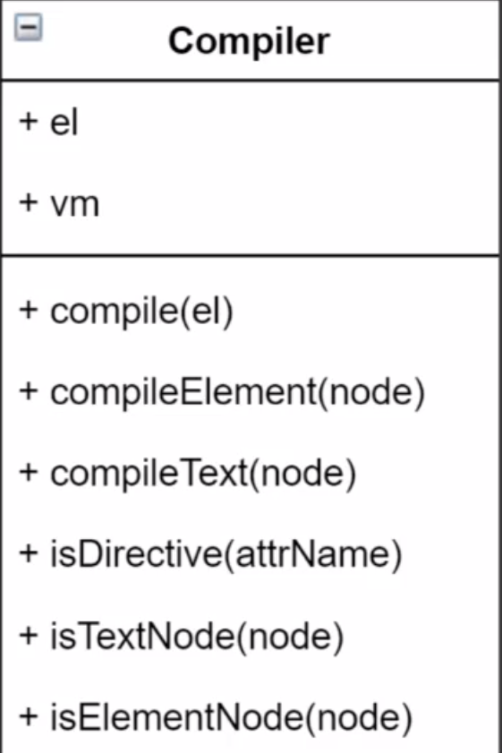
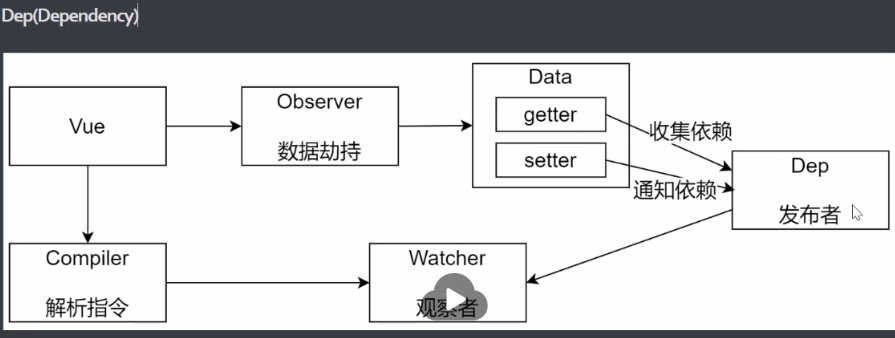
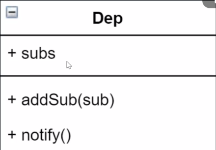

## &#x1F964; task-03 模拟 Vue.js 响应式原理

### &#x1F4DA; 课程目标
  - 模拟一个最小版本的Vue
  - 响应式原理在面试的常问问题
  - 学习别人优秀的经验 转换成自己的经验
  - 实际项目中问题的原理层面的解决
    - 给Vue实例新增一个成员是否是响应式的
    - 给属性重新赋值成对象 是否是响应式的
  - 为学习Vue源码做铺垫

### &#x1F4DA; 数据驱动
  - 准备工作
    - 数据驱动
    - 响应式的核心原理
    - 发布订阅模式和观察者模式
  - 数据驱动
    - 数据响应式 双向绑定 数据驱动
    - 数据响应式
      - 数据模型仅仅是普通的js对象 而当我们修改数据得时候 视图会更新 避免了繁琐的DOM操作 提高开发效率
    - 双向绑定
      - 数据改变 视图改变  视图改变 数据也随之改变
      - 我们可以使用v-model在表单元素上创建双向数据绑定
    - 数据驱动是Vue最独特的特性之一
      - 开发过程中只需要关注数据本身 不需要关注数据是如何渲染到视图的 
      
### &#x1F4DA; 数据响应式核心原理-Vue2\
  - 兼容性IE8+(不包括IE8)
  - Object.defineProperty
    ```js
      // 模拟 Vue 中的 data 选项
      let data = {
        msg: 'hello'
      }

      // 模拟 Vue 的实例
      let vm = {}

      // 数据劫持：当访问或者设置 vm 中的成员的时候，做一些干预操作
      Object.defineProperty(vm, 'msg', {
        // 可枚举（可遍历）
        enumerable: true,
        // 可配置（可以使用 delete 删除，可以通过 defineProperty 重新定义）
        configurable: true,
        // 当获取值的时候执行
        get () {
          console.log('get: ', data.msg)
          return data.msg
        },
        // 当设置值的时候执行
        set (newValue) {
          console.log('set: ', newValue)
          if (newValue === data.msg) {
            return
          }
          data.msg = newValue
          // 数据更改，更新 DOM 的值
          document.querySelector('#app').textContent = data.msg
        }
      })
    ```
  - Object.defineProperty 监听对象多个属性
    ```js
      let data = {
        msg: 'hello',
        count: 10
      }

      // 模拟 Vue 的实例
      let vm = {}

      proxyData(data)

      function proxyData(data) {
        // 遍历 data 对象的所有属性
        Object.keys(data).forEach(key => {
          // 把 data 中的属性，转换成 vm 的 setter/setter
          Object.defineProperty(vm, key, {
            enumerable: true,
            configurable: true,
            get () {
              console.log('get: ', key, data[key])
              return data[key]
            },
            set (newValue) {
              console.log('set: ', key, newValue)
              if (newValue === data[key]) {
                return
              }
              data[key] = newValue
              // 数据更改，更新 DOM 的值
              document.querySelector('#app').textContent = data[key]
            }
          })
        })
      }
    ```

### &#x1F4DA; 数据响应式核心原理-Vue3
  - 直接监听对象 而非属性
  - IE 6 新增 IE不支持 性能由浏览器优化
  ```js
    // 模拟 Vue 中的 data 选项
    let data = {
      msg: 'hello',
      count: 0
    }

    // 模拟 Vue 实例
    let vm = new Proxy(data, {
      // 执行代理行为的函数
      // 当访问 vm 的成员会执行
      get (target, key) {
        console.log('get, key: ', key, target[key])
        return target[key]
      },
      // 当设置 vm 的成员会执行
      set (target, key, newValue) {
        console.log('set, key: ', key, newValue)
        if (target[key] === newValue) {
          return
        }
        target[key] = newValue
        document.querySelector('#app').textContent = target[key]
      }
    })

    // 测试
    vm.msg = 'Hello World'
    console.log(vm.msg)
  ```

### &#x1F4DA; 发布订阅模式(publish-subscribe-pattern)
  - 订阅者
  - 发布者
  - 信号中心
  ```js
    // 事件触发器
    class EventEmitter {
      constructor() {
        this.event_case = Object.create(null)
      }
      // 订阅通知
      $on(eventType, handler) {
        this.event_case[eventType] = this.event_case[eventType] || []
        this.event_case[eventType].push(handler)
      }
      // 发布通知
      $emit(eventType) {
        if (this.event_case[eventType]) {
          this.event_case[eventType].forEach(handler => {
            handler()
          })
        }
      }
    }

    // 测试
    let em = new EventEmitter()
    em.$on('click', () => {
      console.log('click1')
    })
    em.$on('click', () => {
      console.log('click2')
    })

    em.$emit('click')
  ```
### &#x1F4DA; 观察者模式
  - 观察者(订阅者) --Watcher
    - update 当事件发生时 具体要做的事情
  - 目标(发布者) -- Dep
    - subs 数组 存储所有的观察者
    - addSub 添加观察者
    - notify 当事件发生的时候 调用所有观察者的update方法
  - 没有事件中心

### &#x1F4DA; 发布订阅模式和观察者模式的区别
  - 观察者模式是由具体的目标调度，比如当事件触发就会调用观察者的update方法 所以观察者和订阅者之间是存在依赖的
  - 发布订阅模式 是由统一的调度中心去调用 因此发布者和订阅者不需要知道对方的存在
  - 

### &#x1F4DA; 模拟Vue响应式原理-分析
  - Vue 基本结构
  - 打印Vue实例观察结构
  - 整体结构

### &#x1F4DA; Vue
  - 功能
    - 负责接收初始化的参数
    - 负责把data中的属性注入到Vue实例  转换成getter和setter
    - 负责调用observer监听data中所有属性的变化
    - 负责调用compiler解析指令/插值表达式
  - 
  - 实现
    ```js
      class Vue {
        constructor(options) {
          // 1. 通过属性保存选项的数据
          this.$options = options || {}
          this.$data = options.data || {}
          this.$el = typeof options.el === 'string' ? document.querySelector(options.el) : options.el
          // 2. 把data中的成员转换成getter 和 setter 注入到Vue实例
          this._proxyData(this.$data)
          // 3. 调用observer对象，监听数据的变化
          // 4. 调用compiler对象，解析插值表达式和指令
        }

        // _ 开头的都是默认私有的
        _proxyData(data) {
          // 1. 遍历data中的所有属性
          Object.keys(data).forEach(key => {
            // 2. 把data的属性注入到vue实例
            // defineProperty 可以给当前绑定的对象添加任意key   也就是下面this虽然没有当前data拥有的属性 但是可以通过defineProperty添加 并且赋值
            Object.defineProperty(this, key, {
              // 可枚举
              enumerable: true,
              // 可遍历
              configurable: true,
              get() {
                return data[key]
              },
              set(newValue) {
                if (data[key] === newValue) {
                  return
                }
                data[key] = newValue
              }
            })
          })
        }
      }
    ```

### &#x1F4DA; observer
  - 功能
    - 负责把data选项中的属性转换成响应式数据
    - data中的某些属性也是对象，把该属性转换成响应式数据
    - 数据变化发送通知
  - 结构
    - 
  - 代码
    ```js
      class Observer {
        constructor(data) {
          this.walk(data)
        }

        walk(data) {
          // 1. 判断data是否为对象
          if (!data && typeof data !== 'object') {
            return
          }
          // 2. 遍历data对象所有属性 绑定get set方法
          Object.keys(data).forEach(key => {
            this.defineReactive(data, key, data[key])
          })
        }

        defineReactive(obj, key, val) {
          Object.defineProperty(obj, key, {
            get() {
              return val
            },
            set(newvalue) {
              if (val === newvalue) {
                return
              }
              val = newvalue
              // 发送通知
            }
          })
        }
      }
    ```
    
### &#x1F4DA; Observer-defineReactive1
  - 解释下 defineReactive为什么要传value
    - 因为获取的是对象中的值 取值的时候又触发了get方法 死循环
    - value传入形成了闭包 value的值会一直保存

### &#x1F4DA; Observer-defineReactive2
  - 1. 当data的中的数据不是基本类型的时候 我们需要把复杂类型的数据内部的属性也绑定 get 和 set
  - 2. 当原本在data属性中是基本类型的数据，后来改变成了复杂数据类型的时候，我们需要把新改变的值也绑定 get 和 set
    ```js
      // 解决办法都是去调用 walk 方法 因为 walk 方法内部实现了对不同类型数据的处理 和 触发绑定 get set 方法函数
    ```

### &#x1F4DA; Compiler
  - 功能
    - 负责模板编译 解析指令/插值表达式
    - 负责页面的渲染
    - 当数据发生变化的时候重新渲染视图
  - 结构
    - 
  - 代码
    ```js
      class Compiler {
        constructor(vm) {
          this.el = vm.$el
          this.vm = vm
          this.compiler(this.el)
        }
        // 编译所有节点 如果是文本节点就解析插值表达式  如果是元素节点就解析指令
        compiler(el) {
          // el.childNodes 伪数组 所以需要Array.from 转换成数组
          Array.from(el.childNodes).forEach(node => {
            if (this.isTextNode(node)) {
              this.compilerText(node)
            } else if (this.isElementNode(node)) {
              this.compilerElement(node)
            }
            // 如果当前元素存在子元素 则递归调用
            if (node.childNodes && node.childNodes.length) {
              this.compiler(node)
            }
          })
        }
        // 解析元素节点的指令
        compilerElement(node) {
          // 1. 遍历当前元素所有属性
          Array.from(node.attributes).forEach(attr => {
            // attr就是当前属性的描述
            // attr.name 当前属性名
            // attr.value 当前属性值
            let attrName = attr.name
            // 判断当前属性是不是V指令
            if (this.isDirective(attrName)) {
              // v-text -> text
              attrName = attrName.substr(2)
              let key = attr.value
              this.update(node, key, attrName)
            }
          })
        }
        update(node, key, attrName) {
          // 通过指令名称调用指定的处理函数
          let updateFn = this[attrName + 'Updater']
          // 判断当前 处理函数 是否存在 存在就将当前节点  和  节点对应的数据传入 vm是当前Vue实例
          updateFn && updateFn(node, this.vm[key])
        }
        // text指令的具体实现 需要改变当前节点的内容
        textUpdater(node, value) {
          node.textContent = value
        }
        
        // model指令的具体实现 只需要改变当前input的内容
        modelUpdater(node, value) {
          node.value = value
        }

        // 解析插值表达式
        compilerText(node) {
          // 利用正则匹配插值表达式的内容 通过this.vm 去获取实际数据替换
          // {} 转义  . 匹配一个字符 + 重复上一个 ？非贪婪模式  ()分组
          let reg = /\{\{(.+?)\}\}/
          let value = node.textContent
          if (reg.test(value)) {
            // trim 去除空格
            // $1 上面正则利用()分组  每一个()就是一个分组  $1 获取分组1  以此类推
            let key = RegExp.$1.trim()
            // 之后使用replace替换节点内容
            node.textContent = value.replace(reg, this.vm[key])
          }
        }
        // 判断当前的属性是否是一个指令
        isDirective(attrName) {
          return attrName.startsWith('v-')
        }
        // 判断是文本节点
        isTextNode(node) {
          return node.nodeType === 3
        }
        // 判断是元素节点
        isElementNode(node) {
          return node.nodeType === 1
        }
      }
    ```

### &#x1F4DA; Dep
  - 功能
    - 给每一个响应式数据收集依赖 当数据发生变化的时候调用观察者Watcher的update方法 
    - 依赖收集 添加观察者Watcher
    - 通知所有观察者
  - 结构
    - 
    - 
  - 代码
    ```js
    ```