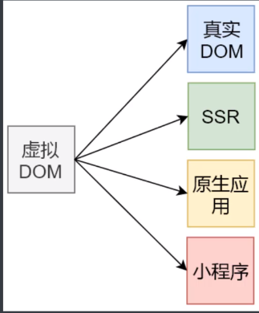

## &#x1F964; task-04 Virtual DOM 的实现原理

### &#x1F4DA; 课程目标
  - 了解什么是虚拟DOM 以及虚拟DOM的作用
  - Snabbdom 的基本使用
  - Snabbdom 的源码解析

### &#x1F4DA; 什么是虚拟DOM
  - Virtual DOM (虚拟DOM) 是有普通的js对象来描述 DOM 对象 因为不是真实的 DOM 对象 所以叫做 Virtual DOM
  - 可以使用 Virtual DOM 描述 真实的 DOM
    ```js
      {
        sel: 'div',
        data: {},
        children: undefined,
        elm: undefined,
        key: undefined
      }
    ```
  - 从上面的虚拟 DOM 可以看到 创建一个 虚拟DOM 成本要小很多 

### &#x1F4DA; 为什么使用虚拟DOM
   - 手动操作 DOM 比较麻烦， 还需要考虑浏览器的兼容性问题 虽然有jQuery等 简化了DOM操作 但是随着项目的复杂 DOM 的操作也越来越复杂
   - 为了简化 DOM 的复杂操作于是有了各种 MVVM 的框架 MVVM 框架解决了视图和状态的同步问题
   - 为了简化视图的操作我们可以视同模板引擎， 但是模板引擎没有根本解决跟踪状态变化的问题 于是有了 Virtual DOM 
   - Virtual DOM 的好处是当状态改变的时候不需要立即更新 DOM 只需要创建一个虚拟DOM树来描述 DOM， Virtual DOM 内部将搞清楚如何有效( diff )的更新DOM
   - Virtual DOM github的描述
    - 虚拟DOM 可以维护程序的状态 跟踪上一次的状态
    - 通过比较前后两次状态的差异更新真实的DOM

### &#x1F4DA; 虚拟DOM的作用
  - 维护视图和状态的关系 只记录状态的变化 只更新状态发生变化的位置
  - 复杂视图情况下提升渲染性能
  - 除了渲染DOM意外 还可以实现SSR(Nuxt.js/Next.js) 原生应用(Weex /React Native) 小程序(mpvue/uni-app)等
  - 
  - Virtual-DOM 库
    - Snabbdom
      - Vue 2.x 内部使用的 VirtualDOM 就是改造的Snabbdom
      - 大约 200 SLOC (single line of code)
      - 通过模块可扩展
      - 源码使用 TS 开发
      - 最快的 Virtual DOM 之一
    - vitual-dom

### &#x1F4DA; 创建项目
  - 打包工具为了方便使用 parcel
  - 创建项目 并且安装 parcel
    - npm init -y
    - npm install parcel-bundler
  - 创建启动指令
    ```json
      {
        "scripts": {
          "serve": "parcel index.html",
          "build": "parcel build index.html"
        },
      }
    ```

### &#x1F4DA; 导入Snabbdom
  - Snabbdom 文档
    - https://github.com/snbbdom/snabbdom
  - 安装Snabbdom
    - npm run serve
  - 导入 Snabbdom
    - 以 export 导出
      ```js
        import { h, init, thunk } from 'snabbdom'
      ```
  - Snabbdom 的核心是提供了 最基本的功能 只导出了三个函数 init() h() thunk()
    - init() 是一个高阶函数 返回patch()
    - h() 返回虚拟 DOM 节点 VNode 这个函数我们在使用 Vue 的时候见过
      ```js
        new Vue({
          router,
          store,
          render: h=> h(App)
        }).$mount('#app')
      ```
    - thunk() 是一种优化策略 可以在处理不可变的数据的时候使用
  - npm install snabbdom@0.7.4
    - 此版本导入方式
      ```js
        import {init, h, thunk} from 'snabbdom'
      ```
      