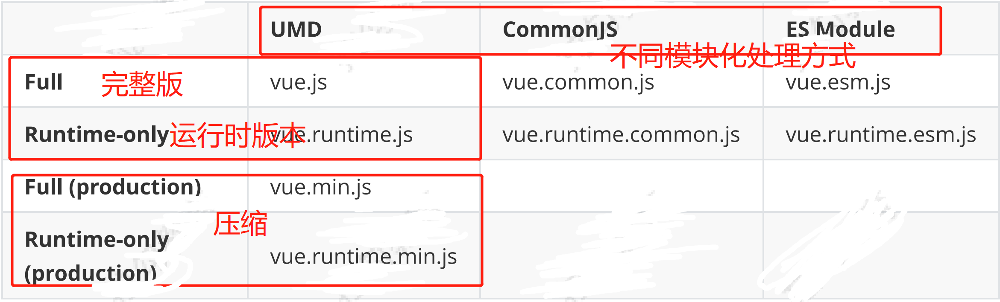

## &#x1F964; task-01 Vue.js 源码剖析-响应式原理

### &#x1F4DA; 1. 课程目标
  - vue的静态成员 和 实例成员的初始化过程
  - 首次渲染的过程
  - 数据响应式原理

### &#x1F4DA; 2. 准备工作-目录结构
  - src
    - compiler      编译相关
    - core          Vue 核心相关
    - platforms     平台相关代码
    - server        SSR 服务端渲染
    - sfc           .vue 文件编译为 js 对象
    - shared        公共的代码

### &#x1F4DA; 3. 准备工作-调试
  - 打包工具
    - Rollup
      - Vue.js 源码的打包工具使用的是 Rollup，比 Webpack 轻量
      - Webpack 把所有文件当做模块，Rollup 只处理 js 文件更适合在 Vue.js 这样的库中使用
      - Rollup 打包不会生成冗余的代码
    - 安装依赖
      - npm init
    - 设置 sourcemap
      - package.json 文件中的 dev 脚本中添加参数 --sourcemap
      - -w 监听文件变化实时打包
      - -c 配置文件
      - --sourcemap 是否开启 sourcemap
      - --environment 环境变量
        ```json
          {
            "dev": "rollup -w -c scripts/config.js --sourcemap --environment TARGET:web- full-dev"
          }
        ```
    - npm run build 可以将不同的版本都打包
  - 调试
    - examples 的示例中引入的 vue.min.js 改为 vue.js
    - 打开 Chrome 的调试工具中的 source

### &#x1F4DA; 4. 准备工作-Vue的不同构建版本
  - dist\README.md
  - 
  - 术语
    - 完整版：同时包含**编译器**和**运行时**的版本。
    - 编译器：用来将模板字符串(Template)编译成为 JavaScript 渲染函数的代码，体积大、效率低。
    - 运行时：用来创建 Vue 实例、渲染并处理虚拟 DOM 等的代码，体积小、效率高。基本上就是除去编译器的代码
    - UMD：UMD 版本通用的模块版本，支持多种模块方式。 vue.js 默认文件就是运行时 + 编译器的UMD 版本
    - CommonJS(cjs)：CommonJS 版本用来配合老的打包工具比如 Browserify 或 webpack 1。
    - ES Module：从 2.6 开始 Vue 会提供两个 ES Modules (ESM) 构建文件，为现代打包工具提供的版本。
      - ESM 格式被设计为可以被静态分析，所以打包工具可以利用这一点来进行“tree-shaking”并将用不到的代码排除出最终的包。
      - ES6 模块与 CommonJS 模块的差异
  - Runtime + Compiler vs. Runtime-only
    ```js
      // Compiler 
      // 需要编译器，把 template 转换成 render 函数 
      // const vm = new Vue({ 
      //   el: '#app', 
      //   template: '<h1>{{ msg }}</h1>', 
      //   data: { 
      //     msg: 'Hello Vue' 
      //   } 
      // })
      // Runtime 
      // 不需要编译器 
      const vm = new Vue({ 
        el: '#app', 
        render (h) { 
          return h('h1', this.msg) 
        },
        data: { msg: 'Hello Vue' } 
      })
    ```
  - 推荐使用运行时版本，因为运行时版本相比完整版体积要小大约 30%
  - 基于 Vue-CLI 创建的项目默认使用的是 vue.runtime.esm.js
    - 通过查看 webpack 的配置文件
      ```js
        vue inspect > output.js
      ```
    - 注意： *.vue 文件中的模板是在构建时预编译的，最终打包后的结果不需要编译器，只需要运行时版本即可
  - 获取Vue-cli 中 webpack 完整的配置
    - 在当前目录输入 vue inspect > output.js
    - 或者 vue ui 可以看到webpack的完整的配置

### &#x1F4DA; 5. Vue 首次渲染的过程
  - 首先进入的是`core/instance/index.js`
    - 定义了`Vue的构造函数` 在构造函数中调用了 `_init()` 方法
      - `init`方法
        1. 先是给Vue实例做了`标记`
          ```js
            // 当前标记是在observe(响应式处理)的时候 判断当前是不是Vue实例  如果是Vue实例 则不需要响应式处理
            vm._isVue = ture
          ```
        2. 判断当前Vue实例是不是组件 来合并 `options` 选项
          ```js
            if (options && options._isComponent) {
              // 如果是组件 则通过下面合并options选项
              initInternalComponent(vm, options)
            } else {
              // 如果不是组件 也就是当前是创建Vue实例 使用下面的方法合并options
              vm.$options = mergeOptions(
                // 和Vue构造函数中的options进行合并
                resolveConstructorOptions(vm.constructor),
                options || {},
                vm
              )
            }
          ```
        3. 判断当前的环境----如果是开发环境
          ```js
            initProxy(vm)
            // initProxy 实现
            // 先判断当前浏览器环境是否支持proxy对象
            // 支持   就创建一个Proxy实例 代理Vue实例
            // 不支持 直接把Vue实例设置给_readerProxy  vm._readerProxy = vm
            
          ```
        4. 判断当前的环境----如果是生产环境
          ```js
            vm._readerProxy = vm
          ```
        5. 初始化一些内容
          ```js
            // expose real self
            vm._self = vm
            // 初始化函数 给 Vue实例成员初始化
            // 初始化生命周期相关的钩子函数
            initLifecycle(vm)
            // 初始化一些事件
            initEvents(vm)
            // 初始化render函数
            // $slots  $scopedSlots  _c  $createElement  $attrs  $listeners
            initRender(vm)
            // 触发生命周期函数  beforeCreate
            callHook(vm, 'beforeCreate')
            // 实现依赖注入 inject
            initInjections(vm) // resolve injections before data/props

            // 初始化了 props methods data computed watch
            // 并将对应属性设置成响应式挂载到 vm 实例
            initState(vm)

            // 实现依赖注入 provide
            initProvide(vm) // resolve provide after data/props
            // 触发生命周期函数  beforeCreate
            callHook(vm, 'created')
          ```
        6. 调用 $mount方法 进入 entry-runtime-with-compiler.js
          ```js
            // 把模板转换成render函数
            if (!options.render) {
              // 如果没有render函数就把模板编译成render函数
              let template = options.template
              // 如果模板存在
              if (template) {
                // 且模板是字符串
                if (typeof template === 'string') {
                  // 如果模板是ID选择器
                  if (template.charAt(0) === '#') {、
                    // 获取对应DOM的innerHTML
                    template = idToTemplate(template)
                    /* istanbul ignore if */
                    if (process.env.NODE_ENV !== 'production' && !template) {
                      warn(
                        `Template element not found or is empty: ${options.template}`,
                        this
                      )
                    }
                  }
                } else if (template.nodeType) {
                  // 如果模板是元素 则获取当前模板的元素的innerHTML
                  template = template.innerHTML
                } else {
                  if (process.env.NODE_ENV !== 'production') {
                    warn('invalid template option:' + template, this)
                  }
                  return this
                }
              } else if (el) {
                template = getOuterHTML(el)
              }
              // 接下来判断是否有 template 如果有就调用 compileToFunctions 把模板转换成reader函数
              if (template) {
                /* istanbul ignore if */
                if (process.env.NODE_ENV !== 'production' && config.performance && mark) {
                  mark('compile')
                }
                // staticRenderFns 优化的一个方法
                const { render, staticRenderFns } = compileToFunctions(template, {
                  outputSourceRange: process.env.NODE_ENV !== 'production',
                  shouldDecodeNewlines,
                  shouldDecodeNewlinesForHref,
                  delimiters: options.delimiters,
                  comments: options.comments
                }, this)
                // reader 函数生成以后 存储到 options 中
                options.render = render
                options.staticRenderFns = staticRenderFns

                /* istanbul ignore if */
                if (process.env.NODE_ENV !== 'production' && config.performance && mark) {
                  mark('compile end')
                  measure(`vue ${this._name} compile`, 'compile', 'compile end')
                }
              }
            }
            // 最后调用mount 方法  中又调用了 mountComponent 这里就是和环境无关的代码了
          ```
          getOuterHTML 的实现
          ```js
            function getOuterHTML (el: Element): string {
              if (el.outerHTML) {
                return el.outerHTML
              } else {
                const container = document.createElement('div')
                container.appendChild(el.cloneNode(true))
                return container.innerHTML
              }
            }          
          ```

        7. 调用 mountComponent 方法 进入 core/instance/lifecycle.js
          ```js
            // 先判断了 当前的选项中是否有reader函数 
            // 判断当前是否是运行时环境  并且传入了模板
            // 但是此时如果是开发环境的话 会发送一个警告 当前使用的是运行时版本 编译器是无效的
            // 如果我们没有传入reader 编译器会把模板编译成reader函数
            if (!vm.$options.render) {
              vm.$options.render = createEmptyVNode
              if (process.env.NODE_ENV !== 'production') {
                /* istanbul ignore if */
                if ((vm.$options.template && vm.$options.template.charAt(0) !== '#') ||
                  vm.$options.el || el) {
                  warn(
                    'You are using the runtime-only build of Vue where the template ' +
                    'compiler is not available. Either pre-compile the templates into ' +
                    'render functions, or use the compiler-included build.',
                    vm
                  )
                } else {
                  warn(
                    'Failed to mount component: template or render function not defined.',
                    vm
                  )
                }
              }
            }
            // 之后触发了生命周期的钩子函数  beforeMount
            callHook(vm, 'beforeMount')

            // 更新组件  挂载
            let updateComponent
            /* istanbul ignore if */
            if (process.env.NODE_ENV !== 'production' && config.performance && mark) {
              updateComponent = () => {
                // 下面如果是开发环境 并且启动了性能检测 下面是性能检测有关的代码
                const name = vm._name
                const id = vm._uid
                const startTag = `vue-perf-start:${id}`
                const endTag = `vue-perf-end:${id}`

                mark(startTag)
                const vnode = vm._render()
                mark(endTag)
                measure(`vue ${name} render`, startTag, endTag)

                mark(startTag)
                vm._update(vnode, hydrating)
                mark(endTag)
                measure(`vue ${name} patch`, startTag, endTag)
              }
            } else {
              updateComponent = () => {
                // 之后调用 _update 方法  
                // vm._render() 调用用户传入的reader 或者被编译器生成的reader的  返回 visualDOM
                // 之后将visualDOM传入 _update 转换成真实DOM 
                // 但是当前 updateComponent 只是定义 没有执行
                vm._update(vm._render(), hydrating)
              }
            }
            // 之后调用 Watcher 将 updateComponent 传入 执行
            new Watcher(vm, updateComponent, noop, {
              before () {
                if (vm._isMounted && !vm._isDestroyed) {
                  callHook(vm, 'beforeUpdate')
                }
              }
            }, true /* isRenderWatcher */)
            // ...
            // 最后通过 callHook 触发了 mounted 钩子函数
            if (vm.$vnode == null) {
              vm._isMounted = true
              callHook(vm, 'mounted')
            }
          ```
        8. 接着进入 上面的 Watcher 方法 进入 core/observe/watcher.js
          ```js
            // Watcher
            // 在Vue中有 三中 Watcher
            // 第一种是 渲染    Watcher
            // 第二种是 计算属性 Watcher
            // 第三种是 侦听器   Watcher
          ```
          ```js
            // -----------------------------
            // 这是在lifecycle调用 lifecycle 调用 Watcher 传入的参数
              new Watcher(vm, updateComponent, noop, {
                before () {
                  if (vm._isMounted && !vm._isDestroyed) {
                    callHook(vm, 'beforeUpdate')
                  }
                }
              }, true /* isRenderWatcher */)
            // -----------------------------
            export default class Watcher {
              constructor (
                vm: Component,
                expOrFn: string | Function,
                cb: Function,
                options?: ?Object,
                isRenderWatcher?: boolean
              ) {
                this.vm = vm
                if (isRenderWatcher) {
                  vm._watcher = this
                }
                vm._watchers.push(this)
                // options
                if (options) {
                  this.deep = !!options.deep
                  this.user = !!options.user
                  // 是否延迟执行 当前没有传入  lazy  所以是undefined 
                  this.lazy = !!options.lazy
                  this.sync = !!options.sync
                  this.before = options.before
                } else {
                  this.deep = this.user = this.lazy = this.sync = false
                }
                this.cb = cb
                this.id = ++uid // uid for batching
                this.active = true
                this.dirty = this.lazy // for lazy watchers
                this.deps = []
                this.newDeps = []
                this.depIds = new Set()
                this.newDepIds = new Set()
                this.expression = process.env.NODE_ENV !== 'production'
                  ? expOrFn.toString()
                  : ''
                // parse expression for getter
                // 也就是传入的 updateComponent
                if (typeof expOrFn === 'function') {
                  this.getter = expOrFn
                } else {
                  // 当我们创建侦听器的时候会传入字符串 然后会接着处理
                  this.getter = parsePath(expOrFn)
                  if (!this.getter) {
                    this.getter = noop
                    process.env.NODE_ENV !== 'production' && warn(
                      `Failed watching path: "${expOrFn}" ` +
                      'Watcher only accepts simple dot-delimited paths. ' +
                      'For full control, use a function instead.',
                      vm
                    )
                  }
                }
                // 当前 this.lazy = false  所以调用 this.get()
                this.value = this.lazy
                  ? undefined
                  : this.get()
              }

              /**
               * Evaluate the getter, and re-collect dependencies.
              */
              get () {
                // 每一个组件对应一个 Watcher
                // Watcher 会渲染视图
                // 如果组件有嵌套会先渲染内部的组件
                // 所以要把父组件的 Watcher 先保存起来
                pushTarget(this)
                let value
                const vm = this.vm
                try {
                  // 当前的  getter  也就是上面传入的第二个参数  在这里调用了 updateComponent 并且指向Vue实例
                  // 而在 updateComponent 中 调用了  
                  // vm._update()
                  // 而 _update 将 visualDOM 转换成真实DOM 渲染到界面上
                  value = this.getter.call(vm, vm)
                  // 当这里执行完成之后 会回到 lifecycle调用 Watcher的地方继续执行 从而触发钩子函数 mounted
                } catch (e) {
                  if (this.user) {
                    handleError(e, vm, `getter for watcher "${this.expression}"`)
                  } else {
                    throw e
                  }
                } finally {
                  // "touch" every property so they are all tracked as
                  // dependencies for deep watching
                  if (this.deep) {
                    traverse(value)
                  }
                  popTarget()
                  this.cleanupDeps()
                }
                return value
              }
            }
          ```

  - 然后进入的是`core/index.js`
    - 之后调用了`initGlobalAPI()`方法 初始化了Vue的静态成员 
  - 之后进入的是`web/runtime/index.js`
    - 在这个文件中初始化了一些和平台相关的内容
    - 最后还挂载了 `__patch` 和 `$mount` 两个方法
  - 第四个文件是入口`web/entry-runtime-with-compiler.js`
    - 在这个文件中重写了`$mount`增加了编译功能 也就是把模板编译成reader函数